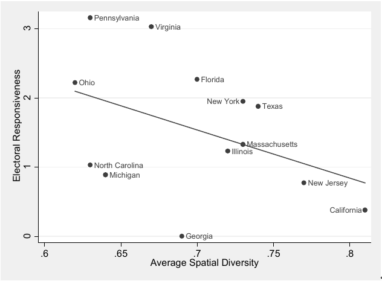
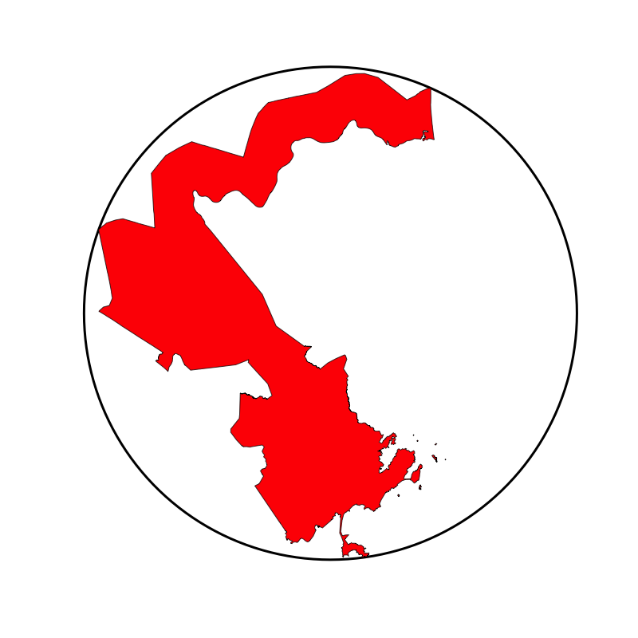
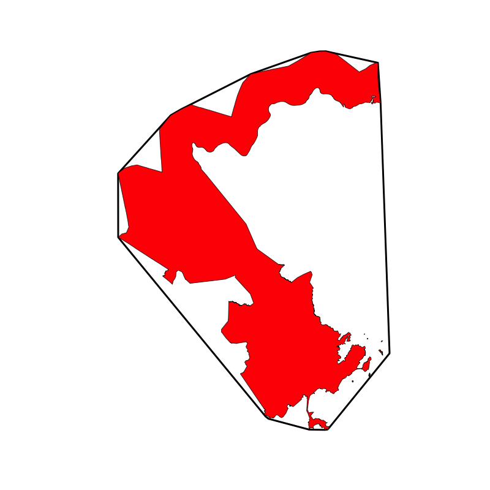
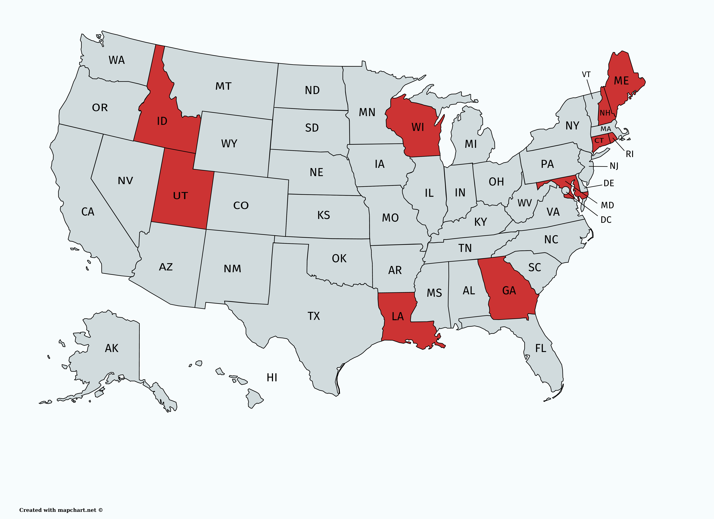
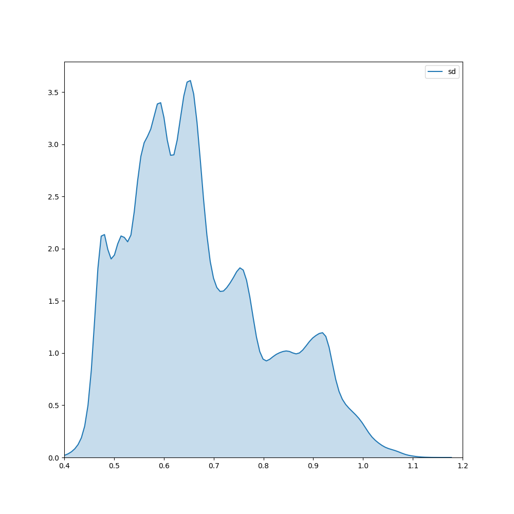
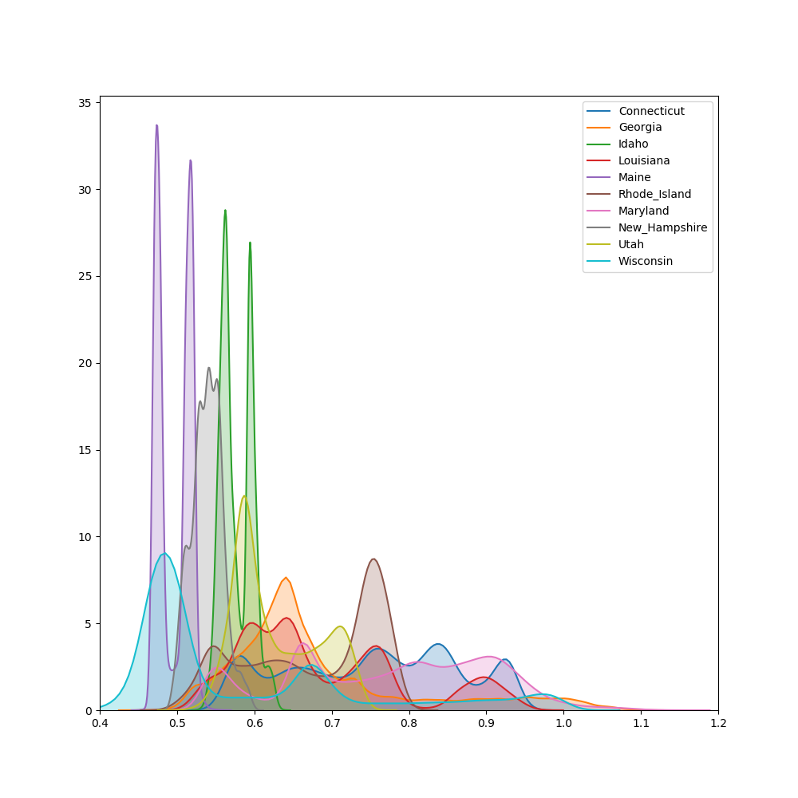
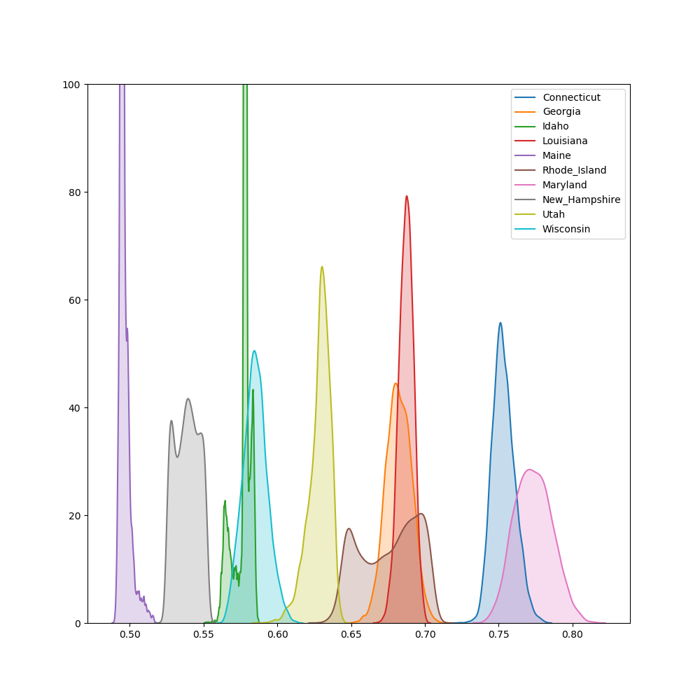
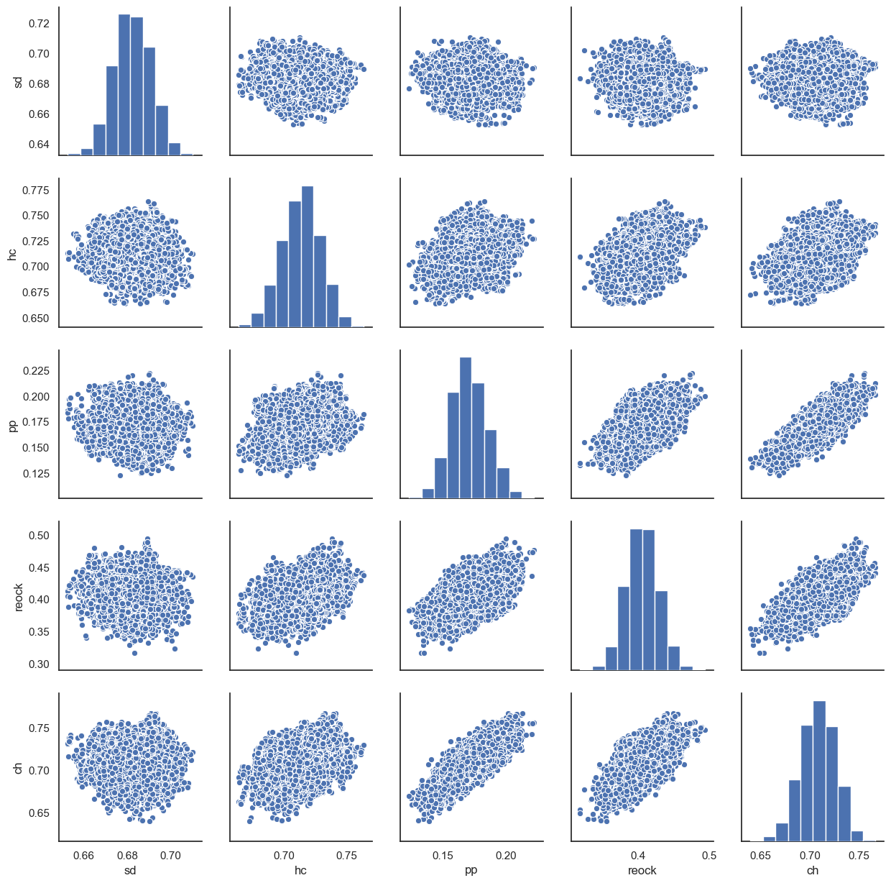

\def\citeapos#1{\citeauthor{#1}'s (\citeyear{#1})} 

## Introduction

Research shows that districts that consist of more homogeneous groups of voters
achieve better representation on several dimensions. And many statutes require
that districts be "reasonably compact". However, some have argued that
requiring compactness may come at the cost of district homogeneity by drawing
districts without regard for communities of interest, which has deletrious
effects on democratic outcomes like representation and responsiveness. Are
compactness and homogeneity fundamentally conflicting goals? Are some measures
of compactness more consistent with homogeneity than others? 

I make two contributions in this work. First, I develop a new compactness
metric (*human compactness*) that improves upon previous measures by
incorporating a notion of travel times. Second, I use a Markov Chain Monte
Carlo (MCMC) approach to generate a large sample of districting plans and
consider empirically how compactness and homogeneity trade off with one
another. I find no trade-off between compactness and homogeneity across all
four compactness measures I examine. I further find that my human compactness
measure consistently produces more homogeneous districts, suggesting that a
judicious choice of compactness metric can in fact encourage better electoral
outcomes.

## Why compactness?

Thirty-sven states require their legislative districts be reasonably compact,
and eighteen states require congressional districts to be compact as well
(Levitt 2019). Why do states do this? Simply put, demanding compactness is a
procedural safeguard against gerrymandering. Gerrymandering is performed by
packing and cracking, which involves either pulling disparate blocs from
far-flung communities into a singular tendril-like district, or splitting
natural blocs of voters into multiple districts to dilute their influence. In
order to do so, districts must be drawn in a very contorted way which a
compactness test picks up on. As \cite{pp1991} put: "Without the ability to
distend district lines ...  it is not possible to gerrymander. The diagnostic
mark of the gerrymander is the noncompact district." Their assertion that
gerrymandering is impossible if compactness is mandated has been supported by
the literature. \cite{altman1998} writes that "compactness standards can be
used to limit gerrymandering, but only if such standards require severe
compactness". And \cite{apollonio2006} use both theoretical graph-theoretic
models as well as experimental computational results and find that "compactness
is a good shield against the practice of gerrymandering".

For this reason, the courts have long relied on compactness as a marker of
gerrymandering. In *Davis v. Bandemer*, Justices Powell and Stephens pointed to
compactness as a major determinant of partisan gerrymandering. And, as
\cite{altman1998} writes:

> In Shaw v. Reno (1993), the Court allowed a challenge to North Carolina’s
redistricting plan to proceed on the basis that the ill-compactness of the
districts indicated a racial gerrymander. Justice O’Connor’s words in this case
especially emphasized the role district shape played in the decision: 'we
believe that reapportionment is one area in which appearances do matter.'...
Justice O’Connor, writing for the majority in Bush v. Vera (1996) declares that
violations of compactness and other districting principles are necessary
conditions for strict scrutiny to apply.

## The problem with compactness

While compactness is undoubtedly an important and useful measure in preventing
gerrymandering, it may not come without costs. Some have argued that
compactness may conflict with other desired criteria such as minority vote
share, electoral competitiveness, keeping communities of interest together, and
so on. \citep{cain1984}, \cite[karlan1989}. Recent work has lent support to
such a view. \cite{ddj2019comp} show that mandating competitiveness has effects
on the partisan lean of the districting plans. And \cite{s2020} finds that
compactness and partisan symmetry (competitiveness) are somewhat incompatible,
suggesting that mandating compactness may have unwanted effects on desired
electoral outcomes.

In this work, I will examine the possible conflict between compactness and
community. We know that communities of interest are important: Twenty-four
states explicitly mention communities of interest, asking that they be
considered in the redistricting process \cite{brennan}. And the California
Redistricting Committee ranked maintaining communities of interest fourth in
its list of priorities---above compactness.

It would thus be problematic if mandating compactness meant splitting
communities of interest. \citeauthor{wolf2015} writes that "all [compactness]
does is needlessly and unproductively split communities, cities, and
counties"---in other words, that it separates people with much in common, and
puts together people with little. The question at hand is thus: are more
compact districts more likely to split communities of interest?

## Why homogeneity matters

While the legislature speaks in terms of 'communities of interest', I choose to
redefine it as district homogeneity instead. One big reason is because the
former term is ill-defined and incredibly difficult to measure. As
\citeauthor{altman1998} writes, 

> The question of how redistricting in general, and compactness in particular,
 affects ‘communities of interest’is important, but ill-defined... the term is
 often used when we are unable to more conventionally classify the ‘interest’
 involved. In part because ofthis use of ‘communities of interest’ as a
 catch-all, these communities are difficult to quantify. The lack of an
 objective, quantitative, standard for recognizing such communities makes the
 subject difficult to examine through either statistics or simulation.

We have seen how difficult defining communities of interest can be. In 2010,
the California Redistricting Committee made districting maps that respected
"communities of interest" through a year-long, drawn-out process, which
involved recruiting unbiased candidates to form the committee, holding dozens
of public input hearings, reading through comments and suggestions from over
20,000 individuals and groups, and conducting hundreds of field interviews. It
relied on the "active participation" of citizens across California to weigh in
on an "open conversation" in which "[the commission] deliberated over the best
approach to minimize the splitting of cities, counties, neighbourhoods, and
local communities of interest". More recently, the MGGG Redistricting Lab built
a tool inviting members of the public to tag and identify communities of
interest---because "communities of interest are notoriously hard to locate"
\citep{mggg2020}.

In sum, communities of interest are hard to define, hard to measure, and hard
to agree on. This is why I use district homogeneity instead as a proxy for
communities of interest. The big advantage of using district homogeneity is
that we have national-level data in form of the American Community Survey
(ACS), which are the "best available proxies for how closely the districts
correspond to geographic communities of interest" \citet[p.~283]{steph2012}.

Furthermore, district homogeneity tracks communities of interest quite closely.
The idea is simple: people in the same "communities of interest" are often more
alike than not: for instance, they may often be of the same age group, race, or
religion. In fact, communities of interest are often viewed through exactly
that lens. The Constitution of Colorado defines communities of interest as
"ethnic, cultural, economic, trade area, geographic, and demographic factors",
and Massachussets defines them based on "trade areas, geographic location,
communication and transportation networks, media markets, Indian reservations,
urban and rural interests, social, cultural and economic interests, or
occupations and lifestyles". \citep{brennan}. And unlike communities of
interest, there is broad agreement on what homogeneity constitutes (at least in
the general case).

A wealth of evidence suggests that more homogeneous districts have better
democratic outcomes, mainly due to better descriptive and substantive
representation. \cite{heath2016} writes that "a growing body of work has
shown...[that] descriptive---or social representation matters, and all else
being equal, people with a given social characteristic prefer candidates or
leaders who share that characteristic. As Johnston et al. argue 'the more an
agent resembles oneself the more he or she might be expected reflexively to
understand and act on one's own interests'... because the voter observes the
relationship between these traits and real-life behaviour as part of his daily
experience". \cite{ogrady2018} conducts corpus analysis on MPs' parliamentery
speeches and finds that middle-class MPs were less likely to represent the
interests of their working-class voters: their speeches were more likely to be
anti-welfare, and they were less likely to rebel against the party whip when
bills that slashed welfare were passed. In other words, a representative that
mirrors his constituents' descriptive (racial/socioeconomic/religious) makeup
is more likely to act in their best interests.

But in order for a representative to mirror his constituents, his constituents
must be somewhat homogeneous. A single representative cannot resemble multiple
highly heterogeneous populations at once. Professor Bruce Cain writes that if a
district is spatially "divided between nonwhite and white, rich and poor, rural
and urban,", "then it may be very hard for one representative to represent all
factions well." And Professor Thomas Brunell contends that "the more
homogeneous a district, the better able the elected official is to accurately
reflect the views of more of his constituents." \cite{steph2012} further
writes:

> In two well-known series of interviews carried out by political scientists,
elected officials... repeatedly stated that they found it difficult to
represent spatially diverse districts. House members complained that they could
not easily discern the "lowest common denominator of interests” in
geographically varied districts, while state legislators expressed frustration
that they "simply [could not] 'represent' the views of...  diverse groups when
there are sharp conflicts." More conventional studies confirm that
representation (in the sense of responsiveness to constituent interests) is
inversely related to districts’ top-line demographic, economic, and ideological
diversity.

In sum, district homogeneity is important: similar individuals are likely to
have similar legislative concerns, and therefore benefit from cohesive
representation in the legislature. To operationalise district homogeneity, I
use a particular instantiation of homogeneity called *spatial diversity*
developed by Professor Nicholas Stephanopoulos, which measures the variance in
each Congressional Tract along factors such as race, ethnicity, age, income,
education, and so on. The higher the spatial diversity score, the less
homogeneous the district. 


In accordance with the evidence presented so far, Stephanopoulos finds that
district homogeneity and statewide homogeneity are both strong predictors of
democratic outcomes. Figure \ref{sd_rolloff} shows the relationship between
spatial diversity and roll-off rate, which is defined as the difference between
the proportion of voters who cast a ballot for a presidential race, but not for
a lower-ticket (e.g. Congressional) race. Roll-off rates are important
indicators of democratic participation, because they zero in on the confusion,
lack of knowledge, or apathy that prevents voters from casting their vote in
the Congressional race despite having cast a top-ticket vote. Stephanopoulos
finds that increasing spatial diversity increases the roll-off rate, which
makes sense given what we know so far: homogeneous districts are easier to
represent and representatives can better act in their constituents' interests.

And while one might worry that more homogeneous districts would be less
competitive than heterogeneous ones, Stephanopoulos finds that the reverse is
true: empirically, more geographically uniform districts are in fact more
competitive (p. 1922--1923). Stephanopulos finds that homogeneous districts
also tend to be the ones whose elections are most responsive to changes in
public opinion.



Figure \ref{sd_responsiveness} plots the relationship Stephanopoulos found
between spatial diversity and electoral responsiveness. Electoral
responsiveness refers to the rate at which a party gains or loses seats given
changes in its statewide vote share. For instance, if Democrats would win ten
percent more seats if they received five percent more of the vote, then a plan
would have a responsiveness of two. The higher a plan's responsiveness, the
better it is thought to be. Stephanopoulos writes:

> **Advocates of responsive elections... may push
without hesitation for spatially homogeneous districts to be drawn, since it is
these districts that seem most likely (in the aggregate) to reflect the
public’s evolving preferences.**

In sum, district homogeneity is associated with a variety of positive
democratic outcomes.

## Key research questions

In the previous section, I have established the importance of compactness and
raised one possible problem with mandating compactness, namely that it may
cleave communities of interest---causing greater heterogeneity---and lead to
worse democratic outcomes. I then explained one mechanism through which this
could happen: heterogeneity results in decreased descriptive and substantive
representation, which in turn feeds into decreased political participation and
lower responsiveness. If this claim is true, we should seriously reconsider
mandating compactness in state legislation!

So let us examine the claim against compactness. The claim is that mandating
compactness may lead to districts that do not properly represent their
constituents, i.e. are more heterogeneous. But it is unclear if mandating
compact districts results in more heterogeneous districts *overall*. While
*some* very compact districts may split communities, there may also be very
compact districts that do not. The key question is whether there is an
*inherent, fundamental* tradeoff between compactness and homogeneity.

Secondly, while almost all states mandate that districts are drawn in a
"reasonably compact" fashion, they do not specify *how* compactness should be
measured. As there are dozens (if not hundreds) of compactness measures that
have been proposed in the literature, one natural question is to ask which
compactness measure should be used. And while there are many theoretical and
methodological reasons to choose one compactness measure over another, there is
also an empirical consideration. District homogeneity might give us a normative
basis for choosing among the measures if the plans under one compactness
measure are consistently more homogeneous than the others.

Along these lines of thought, I therefore ask the following research questions:

1. Is there an inherent trade-off between compactness and homogeneity?
	- Do more compact districts have better, equal, or worse spatial diversity
 scores?
	- Does it depend on the compactness metric we use?
2. Does spatial diversity give us a normative basis to select one compactness
	 metric over another?

## My contribution (feel like this section should be somewhere else)

I make two main contributions to the literature.

To my knowledge, I am the first to measure the relationship between district
compactness and a non-electoral outcome (district homogeneity/spatial
diversity). A lot of work has focused on the relationship between compactness
and electoral outcomes such as partisan bias and responsiveness.

I also develop a new compactness metric that improves upon previous point-based
measures (e.g. \citeapos{cm2010} bizarreness and \citeapos{fh2011} relative
proximity index) by incorporating a notion of travel times. I show that
optimising over my compactness metric results in more homogeneous districts,
with positive implications for political participation and electoral
responsiveness.

## Research procedure

To answer my research questions, I adopt the following procedure:

1. Generate a large and representative subset of plausible districting plans
2. Evaluate compactness and spatial diversity scores on that subset of plans
3. Analyse the overall relationship between compactness and spatial diversity

This three-step procedure is used by many previous works, including
\cite{cr2013}, \cite{ddj2019comp}, and \cite{s2020}. While the specifics
differ, they all follow the same general procedure. I will explain why this
procedure (analyzing hypothetical districting plans) has advantage over
analyzing enacted or proposed districting plans.

### Why generate many plausible districting plans?

I use a Markov Chain Monte Carlo (MCMC) approach to generate tens of thousands
of counterfactual districting plans. One might ask: What is the point of using
a simulation approach? Why not just use historical districting plans that
actually existed in real life? There are two reasons. Firstly, there have not
been very many historical districting plans. There may be at most twenty
districting plans over the history of a state, but they range from the 1800s to
the 2000s, and it would be difficult---if not impossible---to get accurate data
on these historical plans. But the biggest problem in trying to draw a link
between districting plans and any outcome of interest is that of endogeneity.
Suppose we believe that plans with greater compactness lead to greater
political participation:

$$Compactness \rightarrow Participation$$

To answer this question, we could look at a couple of enacted districting plans
and measure their compactness and political participation. Then we would be
able to run an OLS regression and retrieve the coefficients. But these
coefficients would not have a causal interpretation. We know that compactness
is a result of districting procedures that are political in nature. Political
participation affects who wins the state, and the winning party then has
outsize influence on the next districting plan. The districting plans affect
the outcome of the election, which in turn affects future districting plans.
This makes it incredibly difficult to find the marginal effect of an increase
in compactness on participation.

Even finding natural experiments may not be enough to remove the endogeneity.
The Supreme Court has often struck down proposed districting plans and forced
parties to propose a new one. We can think of this as an exogenous shock and
calculate compactness and political participation in both plans. But even this
has knock-on effects. When the Supreme Court strikes down a plan, it's safe to
say that there will be significantly increased media coverage on the
proceedings---which will surely affect interest and participation in the
subsequent elections.

It would be incredibly useful to vary compactness unilaterally while knowing
that that variation was not due to a previous change in political
participation. But this is precisely what simulation approaches allow us to do.

If the simulations are able to generate a representative sample of all
districting plans (a big caveat---more on this later), then we can solve the
problem of sample size and endogeneity in one fell swoop.

Within a sample of automatically generated plans (which are made to satisfy the
constraints of), there is Y relationship between SD and HC

A simulation approach is therefore advantageous due to the limitations of our
data. But the simulation procedure introduces several new considerations. We
need to choose two things in the procedure: a method to generate districting
plans, and a compactness metric to score these districting plans. This choice
highly consequential: different generating functions and the choice of
compactness metric can give very different results. I now explain how I chose
both of these.

### Overview of compactness measures

To empirically evaluate a trade-off between compactness and homogeneity, we
must first figure out how to measure compactness. I give a brief overview of
the different types of measures and explain the pros and cons of each. I
present a compactness measure that I develop and finally explain my decision to
use an ensemble of four compactness measures to increase the robustness of my
results.[^-1]

[^-1]: I use the phrases "compactness metric" and "compactness measure"
interchangeably.

Over a hundred compactness measures have been proposed in the literature.
Here, I focus on two main families: *geometric* compactness metrics and
*point-wise distance* metrics.

#### Geometric compactness metrics

Geometric compactness metrics are by far the largest class of compactness
measures. They look at some geometric properties of proposed districts. These
properties are most often shapes, area or perimeter---although more esoteric
measures do exist. Here, I explain the three most popular compactness
measures, although other popular compactness measures e.g. Schwartzberg are
qualitatively similar.

##### Polsby-Popper

The Polsby-Popper measure is by far the most popular measure used in the
literature. It is the ratio of the area of the district to the area of a
circle whose circumference is equal to the perimeter of the district
\citep{pp1991}. A perfect circle has a Polsby-Popper score of 1.

$$4\pi \times \frac{A}{P^2}$$


##### Reock

The Reock score is the ratio of the district's area to the area of the
minimum bounding circle that encloses the district's geometry \citep{reock1961}.

$$\frac{Area}{AreaOfMinimumBoundingCircle}$$



##### Convex Hull

The Convex Hull metric is a ratio of the area of the district to the area of
the minimum convex polygon that can enclose the district's geometry. A
circle, square, or any other convex polygon has the maximum Convex Hull score
of 1.

$$\frac{Area}{AreaOfMinimumConvexPolygon}$$




#### Choosing a compactness metric

[^0]: The Polsby-Popper metric measures the ratio of the area of the district
	to the area of a circle whose circumference is equal to the perimeter of the
	district.  But depending on the resolution of the map, the perimeter can be
	effectively infinite. \citeauthor{bswp} find that the choice of resolution
	has "a substantial impact on compactness scores, with the Polsby-Popper score
	especially affected."

Which compactness measure should we choose? All three compactness measures
are well-cited in the literature and enjoy widespread use. They have been
cited in U.S. Supreme Court cases, *amici* briefs, and redistricting
commissions \citep{moncrief2011}. 

Despite their widespread use, however, the problems with compactness measures
are many, and well-covered in the literature. As an example, the most popular
compactness measure in the literature---Polsby-Popper---is sensitive to small
perturbations in data resolution (the coastline problem).[^0] The same is true
for other geometric compactness measures: no single metric is perfect. It is
therefore important to use an *ensemble* of compactness measures to make sure
that one's data and conclusions are robust.

But even this is not enough. Because all three of these compactness measures
are purely geometric, they are all vulnerable to a specific family of
geographic perturbations. Indeed, \cite{bswp} show that minimal changes in the
geometric features of states are enough for the four most popular compactness
measures (Polsby-Popper, Convex Hull, Reock, Schwartzberg) to give very
different conclusions on nominally identical data. That means that small
changes in the way the data is collected or processed can affect the
conclusions we draw. Thus, it is important to include a non-geometric
compactness measure in the ensemble to guard against the possibility that the
results are driven by some small geometric changes. Many such measures have
been proposed. For instance, \cite{dc2016} bring in a discipline of
mathematics---graph theory---to formulate a new metric of compactness. And
\cite{kingwp} use a machine learning model to try and ape human
intuition---quantifying the intuitive metric of "I know it when I see it".

#### Point-wise distance compactness measures

However, one particular class of metrics I term *point-wise distance*
compactness stands out for its ease of understanding (critical if it is to be
persuasive to Supreme Court judges), theoretical attractiveness, and academic
consensus. Roughly speaking, this class of compactness metrics tries to
measure the distance between voters in a district, and assigns higher scores
the lower that distance is.

This class of metrics enjoys strong theoretical grounding. Paramount to the
idea of single-member districts is that there is some value in voters who
live in the same area being put into the same district. \cite{er2019}:

> "Voters in the same area are likely to share political interests; voters in the
same area are better able to communicate and coordinate with one another;
politicians can better maintain connections with voters in the same area;
voters in the same area are especially likely to belong to the same social
communities --- all suggest the importance of voters being located in districts
with their geographic peers."

A wealth of empirical evidence supports the above statement. Arzheimer and
Evans (2012) find that constituents support less strongly candidates that live
far from them, even controlling for strong predictors of vote choice like party
feeling and socio-economic distance. In part, voters strongly support proximate
candidates because they think that these candidates better represent their
interests. Similarly, Dyck and Gimpel (2005) find that voters living further
away from a voting site are less likely to turn out to vote.

In contrast, districts that put people with unrelated, faraway others carve
voters out of their natural communities and are thus to be avoided. We care
about whether co-districtors live in the same area and belong to the same
communities of interest, not just the compactness of their electoral
district. And point-wise distance metrics deliver exactly that.

Therefore, point-wise distance metrics are more intuitive to laymen and
possess a normative bent that more abstract mathematical compactness measures
lack. It has therefore been an active area of development in the literature.
\cite{cm2010} present a measure of "bizarreness", which is the "expected
relative difficulty in traveling between two points within the district". And
\cite{fh2011} measures "the distance between voters within the same district
relative to the minimum distance achievable".

#### An improved point-wise distance metric: Human compactness

Given the difficulties of adapting existing point-based distance metrics to
use driving durations, I develop a new measure called *human compactness*.
This metric incorporates driving durations at the very outset, and builds in
optimisations to run quickly. The human compactness metric measures the ratio
of driving durations between one's nearest neighbours and one's fellow
districtors. This ratio ranges from 0 to 1. The higher this ratio is, the
more compact the district. Intuitively, it encourages drawing districts that
put one's next-door neighbours together in the same district.

The human compactness metric works at three-levels: at the voter-level, the
district-level, and the overall plan-level. At the voter level, human
compactness of a voter is the ratio of: the sum of driving durations to one's
K nearest neighbours, to the sum of driving durations to one's
co-districtors, where K is the number of voters in that voter's district. A
simple example will be illuminating. The following figures give a simple
demonstration of how the human compactness metric is calculated both on the
voter- and district- level.


Figure \ref{hc_demo} shows a highly simplified state assignment, with two
districts, Red and Blue, and three voters in each district. We label each
point from top-left to bottom-right. Note here that Red and Blue are not
partisan affliations: R1, R2 and R3 are red voters simply because they happen
to fall in the Red district.

We will first calculate the individual human compactness score for each voter
in the Red district. Figure \ref{hc_r1} illustrates this for the top-left
voter, R1. First, we find the sum of driving durations between R1 and his
fellow co-districtors R2 and R3. This sum, $5 + 6$, forms the denominator of
the human compactness score.


Next, we find the sum of driving durations between R1 and his nearest
neighbours. Because there are two other voters in his district, we will find
his two nearest neighbours. To find the two nearest neighbours, here I have
drawn a circle centered upon R1, and expanded the circle on all sides until it
touches two other voters. (This is not how the algorithm works in
reality)[^20]. We can see that R1's nearest neighbours are the points B1 and
R2, with a distance of 1.5 and 5 respectively. The human compactness score of
R1 is thus $$HC_{R1} = \frac{d_{B1}+d_{R2}}{d_{R2} + d_{R3}} = \frac{1.5 +
5}{5+6} = 0.59$$

[^20]: The method of drawing an ever-expanding circle to get one's K-nearest
neighbours only works for Euclidean distances. In reality, the "circle of
K-nearest neighbours" will not be a circle, but rather be what is called an
*isochrone*: a line drawn on a map that connects points that have the same
travel duration. The shape of the isochrone will vary with geographic
features like cliffs or man-made features like highways. My implementation of
the human compactness algorithm precomputes all the K-nearest neighbours for
every single point, negating the need to calculate isochrones.


This is how we calculate an individual human compactness score. We repeat the
same procedure with R2 and R3, and obtain $HC_{R2} = \frac{4 + 4.5}{5+4}=0.94$ 
and $HC_{R3} = \frac{2 + 2.5}{4+6} = 0.45$. The compactness score for
point R3 is particularly low. We can see why this is the case in Figure
\ref{hc_r3}. Because point R3 is so close to B2 and B3, it really should be
put in the same district with them---R3 likely lives in the same
neighbourhood and/or community as B2 and B3. This is why the human
compactness metric gives it a very low score.


The *district's* human compactness measure, $HC_R$, simply takes the ratio of
all the sum of distances, as follows:[^21]

$$HC_R = \frac{(1.5+5) + (4 + 4.5) + (2.5 + 2)}{(5+6) + (5+4) + (4+6)} =
0.65$$

[^21]: Another reasonable approach might be take the arithmetic mean of all
individual human compactness scores. In that case the district-level
human compactness score would be $0.59 + 0.94 + 0.45 / 3 = 0.66$, basically
identical to the value we obtained. I suspect that both approaches will give
largely the same results.

Finally, we obtain the districting plan's *plan-level* compactness score by
taking the simple arithmetic mean of all district-level compactness scores.
Other aggregation functions are plausible: for instance, taking the median,
or the root-mean-squared value. In the Results section, I run robustness
checks with the root-mean-squared aggregation function and find qualitatively similar
results.


We have seen how to calculate the human compactness score for a proposed
districting plan. Now we demonstrate the conditions under which human
compactness score will assign better scores.

Figure \ref{hc_better} shows a proposed alternative districting plan. Only
the boundary has changed---the points have not. We can see intuitively that
this plan is more compact. Rather than being "carved out" of his natural
community in a snakelike fashion, R3 is now put in a reasonably-shaped
district with B2 and B3. We can calculate the spatial diversity of this new
district by imputing reasonable distance values for R1--B1 and R2--B1. We
thus get

$$HC_{R*} = \frac{(1.5 + 5) + (1.5+4.5) + (4 + 4.5)}{(1.5+5) + (1.5+4.5) + (5+4.5)} = 0.95$$

As we can see, the new district (and by extension districting plan) is given
a much higher score under the human compactness metric, which largely accords
with our intuitions. The human compactness measure enjoys two significant
advantages over existing approaches. First, the human compactness metric
improves upon the algorithmic complexity of \citeauthor{fh2011}'s algorithm
from an NP-hard problem to one with a $O(n^2)$ polynomial runtime. This is an
exponential decrease in algorithmic complexity. I also use programming
techniques like precomputation and memoisation to decrease the time taken to
compute the metric greatly. My implementation is competitive with
geometry-based compactness measures like Reock: on my machine, both metrics
took roughly the same amount of time (~0.20s per step). This greatly
increases the capability of political science researchers to conduct ensemble
analysis without requiring "room-filling supercomputers". Further details on
these algorithmic optimisations can be found in Appendix A.

Because of these algorithmic improvements and the way I have designed the
metric, I am able to use driving durations rather than Euclidean
(as-the-crow-flies) distances between voters. This is a large improvement
with strong theoretical and empirical support. Many previous scholars have
suggested exactly this, giving it strong theoretical support. It keeps the
metric robust to quirks in political geography like mountains and lakes, and
better represents the notion of natural communities. Empirically, too, the
use of driving durations seems strictly superior in many cases involving
human-scale distances. Working with Nicholas Eubank and Jonathan Rodden, I
update their gerrymandering-detection metric to use driving durations instead
\citep{er2019}. We find a consistently different picture of the social
context of American suburban voters, raising the possibility of false
positives under the Euclidean distance measure \citep*{elrwp}.

Given these considerations, I settle on an ensemble of four different
compactness measures: Polsby-Popper, Reock, Convex Hull, and Human
Compactness. I exclude the Schwartzberg metric as the Schwartzberg and
Polsby-Popper measure are largely mathematically equivalent. Finally, I
include the human compactness metric. This maximises the robustness and
validity of my results.

### Generating plans with automated districting algorithms

In order to find out whether compactness measures track spatial diversity, we
have to generate many counterfactual plausible plans that span the entirety
of possible districting plans and measure the correlation between compactness
and spatial diversity. This requires using a computer to draw a large number
of plans according to some criteria.

The idea of drawing a large number of districting plans with a computer has a
long and storied history, starting in the 60s and 70s. The approach has almost
always been used to identify gerrymandering; for instance \cite{ccd2000} build
an algorithm to "quantitatively [assess] whether the [1990 South Carolina] plan
is a racial gerrymander". More recently, \cite{cr2013} "generat[e] a large
number of hypothetical alternative districting plans that are blind as to party
and race, relying only on criteria of geographic contiguity and compactness."
They do this using a Markov Chain simulation algorithm, a procedure that makes
iterative changes for a large number of steps until a unique districting plan
emerges. At each step of \citeauthor{ccd2000}'s algorithm, they randomly select
a Census Block Group to serve as a "seed" of the district, then randomly add
its neighbouring block groups to it until a district with the desired
population is formed. Similarly, \citeauthor{cr2013} begin by initialising all
voting precincts as an individual, separate district, then randomly
agglomerating neighbouring precincts until the desired number of districts is
reached.

While this standard iterative algorithm enjoys a certain degree of success,
it has one crippling weakness. The way in which this class of algorithms
operates necessarily explores only a tiny subset of all possible districting
plans. Subsequent work pointed out this flaw: \citeauthor{mm2018} wrote that
automated processes "may take a biased sample of all possible legislative
maps... and fail to efficiently produce a meaningful distribution of all
alternative maps".  And \citeauthor{fifieldwp} contend that "[standard Monte
Carlo algorithms] are unlikely to yield a representative sample of
redistricting plans for a target population." [^1] This poses a huge issue for the
validity of any statistical analysis, because any correlation that we discover
on a biased subset of plans may be spurious when measured over the actual
distribution of plans. [^2] 

[^1]: See \cite{fifieldwp}, pg. 16, for a technical explanation of why these algorithms
	don't produce uniform redistricting plans: "For example ..., the creation of
	earlier districts may make it impossible to yield contiguous districts. These
	algorithms rely on rejection sampling to incorporate constraints, which is an
	inefficient strategy. More importantly, the algorithms come with no
	theoretical result and are not even designed to uniformly sample
	redistricting plans."

[^2]: Generating a biased sample is not necessarily a problem if all you want
	to do is *optimise*, e.g. draw the most compact plan possible. Recent work
	builds upon this standard algorithm, using Voronoi diagrams or iterative
	flood fill procedures rather than random chance, to assign the precincts to
	be agglomerated. See \cite{lf2019} for a technical overview.

#### Markov Chain algorithms

Thankfully, scholars have developed an improvement over the standard algorithm
with stronger theoretical guarantees. This second class of algorithms reframe
the districting problem as a *graph partition* problem (borrowing insights from
graph theory and computer science), and use a *Markov Chain Monte Carlo* (MCMC)
approach to sample possible districting plans. This approach is best laid out
in \cite{fifieldwp}. The approach first initialises a specific graph partition.
A graph partition is an assignment of Census Tracts/Blocks to districts ---
basically a districting plan. This is the first step of the Markov Chain. Then
it *flips* a random node of the graph to get another valid partition. This
process is repeated until the Markov Chain approaches its steady state
distribution: when this happens, the Markov chain is called "well-mixed".

This class of algorithms inherit desirable well-known theoretical guarantees of
the Markov Chain.[^3] They are therefore much less likely (both theoretically and
empirically) to generate a biased subset of plans. Conducting a small-scale
validation study on a 25-precinct set, \citeauthor{fifieldwp} compare the
distribution of plans generated by their algorithm to those generated by the
standard redistricting algorithm. They prove that their algorithm produces
plans that hew much more closely to the *actual* distribution of all possible
districting plans.

[^3]: See \cite{ddj2019recom} for a technical overview.

Due to the many advantages of the MCMC approach, I use it in all my analyses.
However, there are many ways to conduct an MCMC analysis. The key question is
how one should sample from the near-infinite pool of possible plans.
State-of-the-art literature in this space use one of three main approaches,
all of which have their pros and cons.

The first is to get a sense for the properties of extremely compact plans
under each compactness measure by using a local optimization technique,
starting at a whole bunch of different initial seeds using the single node
`Flip` proposal. This approach gives us the most compact plans, and is often
used to find the "maximal" or "best" districting plans. However, it will---by
design---only explore a very tiny subset of all plausible districting plans.
Also, because the `Flip` proposal is very state-dependent, the initial state
can affect the results greatly. 

The second is a middle-of-the-road approach, using a global proposal
distribution and a Metropolis-Hasting acceptance function to sample from a
distribution over plans that is proportional to $e^{(-\beta \times
Compactness)}$. This will give us a distribution of plans that is biased
towards compact ones, but also contains some noncompact plans.

One can get different distributions of plans depending on the specific
acceptance (score) function. For instance, \cite{dd2019va} prioritises plans
that have fewer locality splits and/or sustain a Black majority-minority
district. \cite{h2018} use a complicated score function that takes into account
county splitting, population deviation, compactness and minority
representation. If I were to use this approach, I would define four different
score functions corresponding to the different compactness measures, and
compare the resulting distributions that result from each measure.

Finally, one can sample from a distribution that doesn't incorporate any
compactness score at all and extract the plans that achieve a good score
under each metric. This approach is used in \cite{ddj2019comp}, where they
generate a large neutral ensemble of districting plans and then subsequently
filter the plans according to increasingly strict vote-band constraints. The
advantage of this approach is that it casts the widest net: all plausible
districts (subject to the equal population bound) are explored. The
disadvantage is that the odds of sampling an 'optimal' district are
incredibly low, which makes it suboptimal for algorithms that aim to build
the "best" plan.

#### Choosing the best MCMC approach

To recap, there are three plausible MCMC approaches to generate a large subset
of redistricting plans: local optimisation, score function, or neutral
ensemble. I examine them each in turn and decide on the neutral ensemble
approach because it generates the largest and most representative subset of
redistricting plans, which best represents the plans that legislators are
likely to draw in real life.

The first proposal is local optimisation. Local optimisation approaches like
the `Flip` proposal have one key problem.  The "mixing time" of the Markov
Chain under the `Flip` proposal---that is, the number of steps it takes for the
Markov Chain to be "close enough" to the stationary distribution---is very
large. What that means is that the `Flip` proposal tends to generate very
uncompact, snakelike districts in the beginning, as can be seen in Figure
\ref{recom_vs_flip}. It will take millions of steps for plans under the `Flip`
proposal to reach a satisfactory districting plan. As such, I prefer the
Recombination (Recom) distribution by \citeauthor{ddj2019recom}, which uses a
spanning tree method to bipartition pairs of adjacent districts at each step
\citep{ddj2019comp}. This proposal distribution improves upon the `Flip`
proposal by decreasing the mixing time needed to reach a satisfactory
districting plan.


Mixing time aside, the extreme compactness of local optimisation is in fact
something that I want to avoid. I aim to find out if mandating compactness in
state constitutions can inadvertently adversely affect democratic
representation. But restricting one's analysis to extremely compact plans deals
a huge blow to the external validity of any such finding. Redistrictors care
about a lot of other considerations apart from compactness, and therefore most
definitely do not optimise solely over compactness. State constitutions demand
that plans be "reasonably compact", not "maximally compact": it's vanishingly
unlikely that those extremely compact plans would resemble the types of plans
that would be drawn in real life. As such, *even* if I found that optimally
compact plans had greater spatial diversity, this would have very little
bearing on redistricting policy. It's far more instructive to see whether the
relationship holds in the plans that legislators could actually be expected to
draw.

---

Given that legislators care a lot about many different considerations, might it
be better to try and include these considerations into the score function?
This is what the second approach does. While this approach holds strong
theoretical merit, I find that this approach introduces too many degrees of
freedom. The choice of what factors to include in the score function is
contentious: \citeauthor{h2018} use population deviation, Polsby-Popper score,
county boundaries and minority deviation. But they could just as easily have
included factors such as proportionality or number of cut edges (proposed in
\cite{dc2016}) for instance. Even if there is a strong justification for
including exactly those factors, there is still significant researcher freedom
to operationalise the scores. For instance, \citeauthor{h2018} and
\citeauthor{dd2019va} both include a population deviation score, but
operationalise the metric differently. Furthermore, any score function has to
be assigned specific weights--- but this assignment is somewhat arbitrary and
open to argument. For instance, \citeauthor{h2018} "chose a VRA score function
which awards lower scores to districting plans which had one district close to
44.48% African-Americans and a second district close to 36.20%
African-Americans", on the basis that the 2016 districting plan which was
accepted by the Court had districts with those proportions. But this is
incredibly arbitrary. Obviously, just because a particular district was
accepted by the Court with those proportions of African-Americans doesn't imply
that those exact proportions of African-Americans are optimal.

To be clear, these problems are not insurmountable. If there is a strong
theoretical basis for one particular operationalisation over another, then
the criticism of researcher fiat largely loses its bite. Furthermore, the
results obtained are robust to a variety of perturbations. \cite{h2018}
change the weights and threshold values as a robustness check and find
qualitatively similar results. Nonetheless, different results can occur. And
if two different operationalisations or factor weights yield qualitatively
different results, how would we adjudicate between them? For these reasons, I
choose not to use the second approach.

---

The last approach is one that makes the fewest assumptions. It generates a
neutral ensemble and does not favour one plan over another (except for some
minimal compactness and population deviation requirements). This approach
gives us the largest space of plausible plans, which has a key advantage: it
allows the results to be applicable even for districting algorithms that do
not use an MCMC approach. This includes not only the regular low-tech way of
drawing districts, but also other automated districting algorithms like
\cite{mm2018} and \cite{lf2019}.

Therefore, I elect to use the last, "neutral walk" approach. I use a global
`Recom` proposal to generate the states, but accept every proposal subject to
minimal population deviation requirements. This gives me a neutral ensemble
of 10,000 plans for every state.

## Research Procedure (continued)

Now that we have chosen both the compactness metric and the simulation
procedure, we can refine the previous three-step procedure into something more
specific:

1. Use the Recom proposal function to generate a neutral ensemble of 10,000
	 districting plans for every state
2. Calculate spatial diversity and four compactness scores (Polsby-Popper,
	 Reock, Convex Hull, and Human Compactness) for each districting plan
3. Perform data analysis (OLS regressions, difference-in-means test) and obtain
	 results

I now describe each step in detail.

### Generating 100,000 districting plans with the MCMC algorithm

I download Census Tract data from the [United States Census Bureau](census.gov)
website. I use Census Tracts rather than Census Blocks because Census Tracts
are the smallest (highest-resolution) units that have spatial diversity data.

I use the open-source software library GerryChain to generate the ensembles.
Replication code and data are included in the Supplementary Information. I
obtain the ReCom Markov chain procedure from one of the co-authors (Daryl
Deford) of the \cite{ddj2019recom} paper. I then fed the Census Tract data into
the GerryChain library. Using the Recom Markov chain procedure, I generated
10,000 districting plans for 10 states (Connecticut, Georgia, Idaho, Louisiana,
Maine, Maryland, New Hampshire, Rhode Island, Utah, and Wisconsin) for a total
of 100,000 plans.



Figure \ref{states_analysed} marks the states I analysed in red. I chose these
states mainly due to size considerations. All of these states are
small-to-medium sized (in terms of the number of Congressional districts): the
largest states like California, Texas and Florida are absent. This is because
my algorithm scales in both time and memory with the *square* of the size of
the state ($O(n^2)$). The analysis is achievable with larger desktop machines.
Unfortunately, my own laptop had only 8GB of RAM and not very much free disk
space, making it infeasible to examine larger states. Nonetheless, I was still
able to analyse medium-sized states like Louisiana, Maryland and Georgia (14
districts).

Size aside, I tried to get states that spanned the entire country, including
Western states (Idaho, Utah), Southern states (Louisiana, Georgia), and
Northeastern states (New England). I would also have liked to generate plans
from a Pacific state like Oregon and a Midwestern state like Kansas, but time
constraints prevented me from doing so.

Nonetheless, the number of states that I analyse exceeds most other similar
analyses. For instance, the seminal and heavily-cited work \cite{cr2013} only
analyse the state of Florida, and even very recent work by \cite{ddj2019recom}
and \cite{s2020} analyse only five and two states respectively.

### Calculating spatial diversity and compactness scores for 100,000 plans

After generating the plans, I calculate spatial diversity (a measure of
district heterogeneity) and compactness scores for all of them. I obtain data
on spatial diversity from Professor Nicholas Stephanopoulos. The dataset he
gave me has eight *factor scores* for each Census Tract in the country, where a
factor score is a combined variable that covers vital areas like race,
education, profession, marital status, and housing. A district's spatial
diversity score is calculated by the sum of the standard deviation of each
factor score, normalised by the proportion of the variance each factor score
explains. As an example, consider a district made up of three Census Tracts (A,
B, C), and let each Tract have three factor scores (1, 2, 3). Let the
proportion of the variance explained by each factor score be 50%, 30% and 20%
respectively. Then the total spatial diversity score would be:

$$ \sigma(A_1, B_1, C_1) \times 0.5 + \sigma(A_2, B_2, C_2) \times 0.3 + \sigma(A_3,
B_3, C_3) \times 0.2$$

I calculate spatial diversity score for every district, and, following
Stephanopoulos, take the arithmetic mean of all districts in a districting plan
to get the overall spatial diversity score for that plan.

Next, I calculate compactness scores. As the Polsby-Popper metric is so
well-known and widely used, there was already an existing implementation in the
GerryChain library which I made use of. Similarly, existing libraries like
SciPy already had a Convex Hull method. Finally, I wrote my own implementation
of Reock, making use of the Smallest Enclosing Circle code written by Project
Nayuki \citep{nayuki2020}.

In order to calculate human compactness scores, I have to know where voters
live (to calculate driving durations between them). I therefore obtain a
dataset of "voter representative points" (VRPs) from \cite{er2019}. These
points aggregate many actual voters, downsampling the data into a size that can
be worked with. While this down-sampling and placements of points randomly does
introduce some noise, "the variability contributed... is empirically very
small" \citep{er2019}. I sample 1,000 VRPs for each Congressional District in a
state. That means that a state like Maine with two districts will have 2,000
VRPs, and a state like Louisiana---with seven districts before the new
redistricting plan---will have 7,000.

I then calculate all pairwise driving durations between all VRPs using an
open-source routing engine called Open Source Routing Machine (OSRM) built by
\cite{osrm}. The routing engine is able to calculate driving
durations between any two points---very similar to Google Maps---but the
number of queries it can process is orders of magnitude larger than the limits
imposed by the Google Maps API. For these ten states, I calculate about 400
million point-to-point driving durations in total. As point of comparison,
using Google Map's [Distance Matrix
API](https://developers.google.com/maps/documentation/distance-matrix/usage-and-billing)
for that number of requests would cost $1,480,000[^23]. And if I had tried to
analyse California (with 53 Congressional districts), this would require almost
3 billion point-to-point driving durations.

[^23]: Volume discounts do exist, but you have to contact the Sales Team, and I
	doubt I could afford it anyway...

Because my analysis is on the tract level, I map VRPs to Census Tracts using a
spatial join. I sum the pairwise point-to-point distances to get a matrix of
pairwise *tract-to-tract* driving durations. I then sum the driving durations
from each point in the district to another and calculate the human compactness
score for each district.

Finally, I aggregate the individual district scores into a plan-level score by
simply taking the arithmetic mean. For instance, if a districting plan has
three districts with Polsby-Popper scores of 0.25, 0.5, and 1, the
Polsby-Popper score for that plan would be 0.5833. As a robustness check, I
also use the sum of square roots as an aggregation function: that is,
$\sqrt{0.25} + \sqrt{0.5} + \sqrt{1} = 0.736$[^24], obtaining qualitatively
similar results.

[^24]: This penalises districting plans that have a large difference between
	districts e.g. one very good district and one very bad one.

### Performing data analysis on the 100,000 plans

After calculating the overall spatial diversity and compactness scores on all
the plans, I start running exploratory data analysis and statistical tests. The
results are detailed below.

## Results

My key results are as follows:

1. Political geography largely pins down the spatial diversity of each
	 individual district[^25].
2. Different compactness measures have different ideas of what "good" plans
look like.
3. Different compactness measures are correlated with one another[^26]. 
4. Only human compactness is negatively correlated with spatial diversity:
geometric/dispersion-based measures have either no or a positive (bad) effect
on spatial diversity[^27].

[^25]: Small urban districts have high SD, large rural ones have low SD.

[^26]: The geometric compactness measures agree most with one another, the human
		compactness measure not as much.
	
[^27]: OLS regressions with state dummies show that only human compactness has
	a significantly negative coefficient on spatial diversity.
	Difference-in-means tests show that only the most compact plans under human
	compactness are less spatially diverse than average, and are less spatially
	diverse than the most compact plans under geometric/dispersion-based
	measures.

Overall, the evidence suggests that optimising over compactness will give you
less spatially diverse districts, and human compactness will do the best job
of it.

### Initial analysis

Before proceeding to more quantitative statistical tests, I want to show what
the generated plans look like and what the *distribution* of those plans looks
like.

#### The best and worst plans according to different compactness measures

After having obtained all the plans and their corresponding scores, I plot
the plans with the best and worst spatial diversity and compactness scores to
get an understanding for the types of plans that each metric encourages. This
will give us valuable intuition for understanding the subsequent results.

For ease of exposition I show states with only two districts, but the
analysis extends to states with any number of districts. (Plots of the other
eight states are available in the Supplementary Information). I also use
Polsby-Popper to represent the other two dispersion-based compactness metrics
as my explanations are similarly applicable to those metrics.


Figure \ref{nh_minmax} plots the best and worst plans according to several
metrics. Let us begin with the middle row (Polsby-Popper), as its
interpretation is the most straightforward. The Polsby-Popper (and other
dispersion-based) metric penalises districts that are very "snakelike" and
prefers districts that have regular shapes like squares or circles. This is
clearly reflected in the plot. The best plan has a district with a very
regular shape, and the worst plan has a snakelike district that contorts
through half the state.

On the top row is human compactness. A good plan under human
compactness minimises the total travel times between every member of the
district. This encourages small, compact districts that avoid splitting urban
centers.

We can see that the top plan under human compactness corresponds well to the
actual population density of New Hampshire as seen in Figure
\ref{nh_density}. The top plan puts the two most populous and urban counties
in New Hampshire---Rockingham and Hillsborough---together in the same
district. The worst plan under human compactness splits the counties in such
a way that one's co-districtors are far away, and one's nearest neighbours
are in a separate district.

As expected, the top plan under spatial diversity (bottom row) closely
resembles the top plan under human compactness. In relatively homogeneous New
Hampshire, the main source of spatial diversity is the urban-rural divide. A
plan that keeps urbanites together in one district is favoured under spatial
diversity.

And while the worst plan under spatial diversity looks different from that under
human compactness at first glance, they are actually quite similar. Both
plans split up the two populous urban counties, having a "fish-hook" shaped
district that starts from the rural north of the state and swoops down to the
south to carve out a large part of the counties.

This case study shows that dispersion-based measures may not always reflect
existing communities of interest. This seems to fuel criticism of
dispersion-based measures on exactly that basis ("it makes no sense to
combine areas that have nothing in common except that they fit neatly into a
square" \citep{wolf2015}). In this example, human compactness and spatial
diversity agree neatly on what the best districting plans should look like.

While human compactness generally tracks spatial diversity better than other
compactness metrics (I provide evidence for this later), it does not always
do so. Figure \ref{idaho_density} gives the population of Idaho. We can see
that a large proportion of the population is concentrated in a U-shaped
"belt" spanning the southern half of the state. A good plan under spatial
diversity will attempt to put this relatively urban "belt" in the same
district, and this is indeed what we observe in Figure \ref{idaho_minmax}.
But due to its great distance and jagged perimeter, such a plan is penalised
under both human compactness and dispersion-based measures, both of which
prefer a relatively compact square-shaped district.


As we can see, compactness measures need not always agree with spatial
diversity, particularly in the case study of Idaho. Intuitively, this seems to
make sense: spatial diversity tries to put similar people together, and people
who live in the same area are often, but not always, similar. 

### Political geography pins down the spatial diversity of each individual district

In this section, I show that spatial diversity varies enormously between
districts, but this is to a large extent dependent on the state's political
geography. I find that small urban districts have high spatial diversity, while
large rural ones have low spatial diversity---regardless of districting plan.
This also extends to the level of the state: while the spatial diversity of
districting plans can range from 0.4 to 0.9, the spatial diversity of a state's
districting plan usually lies within a small range of ~0.05.

Figure \ref{sd_all_districts} is a kernel density estimation (KDE) plot of the
distribution of spatial diversity in all districts. As in
\citeauthor{steph2012}'s results, the distribution appears log-normal, with a
noticeable tail on the right that contains a number of especially heterogeneous
districts.



A tempting conclusion to draw from the data is that these districts are
equally distributed over the different states. In reality, though, the
districts of a state can only take on a small range of values no matter how a
districting plan is drawn. Figure \ref{sd_districts_binned} demonstrates. The
peaks imply a multimodal distribution where individual districts are
clustered around certain values and not others. This is most starkly
displayed in the states with only two districts. Despite the fact that the
redistricting algorithm is continuous, there is a sharp bimodal distribution
present in the states of Idaho and Maine, and to a lesser degree Utah and New
Hampshire.

This finding is somewhat surprising. It implies that even though the MCMC
algorithm explores the entire set of feasible districting plans, any district
in any feasible plan will take on a specific form. In other words---no matter
how one draws the plan, each district's spatial diversity is largely pinned
down by its state's political geography. Some states have very spatially
diverse districts, some states have very homogeneous ones, and this is a
function of their geography and not the way the districts are drawn.



Given that each district's spatial diversity is largely exogenous, we should
expect each state's overall spatial diversity not to vary much as well.
Indeed, we see in Figure \ref{sd_plans} that each state occupies a narrow
band in the range of possible spatial diversity scores. While the range of
spatial diversity scores ranges from 0.50 to 0.80, the range of a state's
spatial diversity score is only 0.05. While this range is small, it is not
insignificant. Figure \ref{sd_responsiveness} shows that an increase in a
state's spatial diversity by 0.05 is correlated with a decrease in electoral
responsiveness by 0.3, about 10% of the variance.



#### Districts that are small and urban are usually more spatially diverse

One finding consistent across all states is that the smaller (by area) the
district, the higher the spatial diversity.


Maryland provides the clearest example, although the same pattern repeats in
all other states. Figure \ref{pairwise_plot} is a correlation- and KDE plot of
different metrics, binned by the area of each district. The most important
figure is the KDE plot in the top left-hand corner. We can see that large
districts (in blue) occupy the low end of the spatial diversity range.
Medium-sized districts (orange) have a bimodal distribution, but it is the
smallest districts (in green) that have the highest spatial diversity.

This finding is quite intuitive. Cities tend to be the most heterogeneous parts
of a state, with people of different races, ages, and socioeconomic classes.
This finding suggests that more urban states will simply have larger spatial
diversity scores---another factor pinning down the spatial diversity of a
state's districting plans.

#### Conclusions of initial data exploration

We have seen that the overall distribution of districts and plans lie within a
tight bound, largely determined by each state's political geography. This
suggests that while districting can exert an effect on political outcomes, we
should not expect optimising for compactness to change spatial diversity very
much.

### Compactness measures largely agree with one another, but human compactness less so

The next key finding is that compactness measures largely agree with one
another, meaning that a proposed plan that scores highly on one compactness
metric will likely score highly on another. The correlations are strongest
between the three geometric compactness measures, and lower (but still
significantly positive) between the geometric and human compactness measures.

This finding is somewhat intuitive---we would expect the different geometric
compactness measures to track each other very closely as they are measuring
very similar concepts. It is much less obvious, however, that a purely
geometric measure would agree with a metric that measures driving durations
between points. This result is encouraging because it shows that these metrics
are able to get at the same concept despite having completely different
theoretical backgrounds.

One way to find the relationship between compactness measures would be to
aggregate all the observations from each state into a pooled data set, and
calculate the pairwise correlations between all such observations. However,
looking at these aggregate results in this way can be highly misleading, as a
single outlier state can bias the results. I therefore look at the correlations
for each individual state instead.

One way to visualise these correlations is through the use of a heatmap. Figure
\ref{connecticut_corr} plots the correlation coefficients between each pair of
metrics. Firstly, we can see the correlation coefficients between spatial
diversity (sd) and the compactness metrics. Here, it seems like human
compactness has a significant negative correlation with spatial diversity, with
the other compactness metrics having little correlation. We can also see that
the correlation between human compactness and geometric compactness measures
are somewhat lower (~0.46) than the correlations between different geometric
measures.


The correlation heatmap of Utah shows a case where human compactness and the
other geometric measures disagree. Here, the correlation between geometric
compactness measures is very high (0.89---almost 1), but there is in fact a
negative correlation between human compactness and the geometric measures.


These results vindicate my choice to use an ensemble of compactness metrics
rather than relying on a single measure. While the correlation between metrics
is high, it is not perfect, and indeed we observe cases like Utah where the
compactness measures disagree.

Another way to visualise the findings is through pairwise scatterplots.  Figure
\ref{pairwise_plot_grouped} is a correlation plot between spatial diversity and
the various compactness metrics for the state of Georgia. These plots have the
advantage of being able to visualise the scatterplots, which can surface
non-linear relationships that a simple correlation coefficient cannot.  In all
of the states, however, the relationship between compactness metrics is always
linear.



I have included correlation matrices and pairwise scatterplots for all ten states in
the Supplementary Information. The overall correlation is positive for most
states and most metrics, with human compactness being less correlated with the
other metrics.

### Only human compactness has a significant negative effect on spatial diversity.

In this section, I run multivariate OLS regressions with country dummies, as
well as difference-in-means tests, and find no significant effects of geometric
compactness on spatial diversity. I find that human compactness has a
significant negative effect on spatial diversity: increasing human compactness
from 0 to 1 decreases spatial diversity by 0.04 points.

#### Multivariate regression with country dummies

We cannot simply run a regression aggregating every single district as each
state has a unique distribution of spatial diversity and compactness.
Consider the following. Within each state, increasing compactness decreases
spatial diversity. But on the aggregate, states with high spatial diversity
also have low compactness. In this case, regressing spatial diversity on the
aggregate level would give an inflated estimate of the actual effect, falling
afoul of the *ecological fallacy*. I illustrate this in figures
\ref{indiv_reg} and \ref{grouped_reg}. In Figure \ref{indiv_reg}, I plot a
graph of human compactness on the x-axis and spatial diversity on the y-axis.
The overall trend seems to be slightly negative: in most of the groups, there
is a slight negative correlation between human compactness and spatial
diversity. However, we would obtain erroneous results if we aggregated the
different states and ran a singular regression. This is depicted in Figure
\ref{grouped_reg}: due to the *between-group* correlation of compactness and
spatial diversity, the estimate of the effect is biased. We must therefore
control for state when running the regression. Thus, I run a multivariate
regression with the functional form $$SpatialDiversity = \beta_0 + \beta_1
Compactness + \beta_2 State$$ where $State$ is a dummy variable, taking care
to avoid the dummy variable trap.

Table \ref{table:ols_sd_hc} shows the results for human compactness. I run
the same regression for each compactness metric and obtain the following:

```
HC: -0.0404, t-value -40.632
PP: +0.0251, t-value 29.841
Reock: +0.0209, t-value 27.645
CHull: -0.0016, t-value -1.801
```

I find that only human compactness has a statistically significant negative
coefficient on spatial diversity, while Polsby-Popper and Reock have a
significant positive effect on spatial diversity. This initial result
suggests two things: firstly, and rather disappointingly, that optimising
over the two most popular compactness measures may have adverse effects on
electoral competitiveness and responsiveness. More encouragingly, though,
these effects can be mitigated by the judicious choice of compactness
measure. The results show that optimising over Convex Hull does not come at
the cost of diversity, and that increasing human compactness actually
decreases spatial diversity.


\begin{table}[h!] 
\begin{center}
\caption{OLS Regression of Spatial Diversity on Human Compactness with
Country Dummies}
\label{table:ols_sd_hc}
\begin{tabular}{lclc}
\toprule
\textbf{Dep. Variable:}    &        sd        & \textbf{  R-squared:         } &     0.988   \\
\textbf{Model:}            &       OLS        & \textbf{  Adj. R-squared:    } &     0.988   \\
\textbf{Method:}           &  Least Squares   & \textbf{  F-statistic:       } & 8.188e+05   \\
\textbf{Date:}             & Wed, 11 Mar 2020 & \textbf{  Prob (F-statistic):} &     0.00    \\
\textbf{Time:}             &     20:23:45     & \textbf{  Log-Likelihood:    } & 3.2365e+05  \\
\textbf{No. Observations:} &      100000      & \textbf{  AIC:               } & -6.473e+05  \\
\textbf{Df Residuals:}     &       99989      & \textbf{  BIC:               } & -6.472e+05  \\
\textbf{Df Model:}         &          10      & \textbf{                     } &             \\
\bottomrule
\end{tabular}
\begin{tabular}{lcccccc}
                      & \textbf{coef} & \textbf{std err} & \textbf{t} & \textbf{P$> |$t$|$} & \textbf{[0.025} & \textbf{0.975]}  \\
\midrule
\textbf{C(state)[09]} &       0.7837  &        0.001     &  1042.069  &         0.000        &        0.782    &        0.785     \\
\textbf{C(state)[13]} &       0.7111  &        0.001     &   993.725  &         0.000        &        0.710    &        0.713     \\
\textbf{C(state)[16]} &       0.6054  &        0.001     &   856.490  &         0.000        &        0.604    &        0.607     \\
\textbf{C(state)[22]} &       0.7149  &        0.001     &  1039.373  &         0.000        &        0.714    &        0.716     \\
\textbf{C(state)[23]} &       0.5303  &        0.001     &   626.929  &         0.000        &        0.529    &        0.532     \\
\textbf{C(state)[24]} &       0.8030  &        0.001     &  1097.735  &         0.000        &        0.802    &        0.804     \\
\textbf{C(state)[33]} &       0.5705  &        0.001     &   725.232  &         0.000        &        0.569    &        0.572     \\
\textbf{C(state)[44]} &       0.7073  &        0.001     &   899.177  &         0.000        &        0.706    &        0.709     \\
\textbf{C(state)[49]} &       0.6561  &        0.001     &   959.927  &         0.000        &        0.655    &        0.657     \\
\textbf{C(state)[55]} &       0.6138  &        0.001     &   858.803  &         0.000        &        0.612    &        0.615     \\
\textbf{hc}           &      -0.0404  &        0.001     &   -40.632  &         0.000        &       -0.042    &       -0.038     \\
\bottomrule
\end{tabular}
\begin{tabular}{lclc}
\textbf{Omnibus:}       & 3979.140 & \textbf{  Durbin-Watson:     } &    1.171  \\
\textbf{Prob(Omnibus):} &   0.000  & \textbf{  Jarque-Bera (JB):  } & 9332.569  \\
\textbf{Skew:}          &  -0.236  & \textbf{  Prob(JB):          } &     0.00  \\
\textbf{Kurtosis:}      &   4.420  & \textbf{  Cond. No.          } &     67.9  \\
\bottomrule
\end{tabular}
\end{center}
\end{table}


#### Only under human compactness do top plans have lower spatial diversity than average

While the results of the overall regression are discouraging, it may not be the
last word. The neutral ensemble approach means that the generated plans run the
whole gamut of compactness scores, including both highly compact plans and
highly noncompact ones in the sample of 100,000. In reality, though,
legislators will try to optimise for compactness to some degree. A plan
proposed in real life---while not being optimally compact---would be reasonably
so. Rather than regressing over the entire sample, then, we should specifically
check the spatial diversity of plans which exceed the threshold of "reasonable
compactness".

But what is the threshold of "reasonable compactness"? The choice of the
threshold cannot be determined *a priori*. One would have to know the
distribution of compactness in a sample of plans generated in real life. Of
course, as real-life expert districtors do not produce a distribution of
plans, this is also a tall order. I therefore run the same OLS regression for
different thresholds of "reasonable compactness", ranging from the top 90%
(excluding the bottom 10%) of plans to the top 10% of plans.[^8] The results
are as follows:

[^8]: The results are similar when we take the top 5% or 2% of plans, but the
small sample sizes of those thresholds mean that it is difficult to get
statistical significance.

```
10th percentile:
                   coef    std err          t      P>|t|
hc              -0.0256      0.001    -19.660      0.000
pp               0.0339      0.001     34.757      0.000
reock            0.0287      0.001     34.723      0.000
ch              -0.0001      0.001     -0.143      0.886

25th percentile:
                   coef    std err          t      P>|t|
hc              -0.0274      0.002    -16.018      0.000
pp               0.0357      0.001     30.861      0.000
reock            0.0307      0.001     33.635      0.000
ch              -0.0024      0.001     -2.153      0.031

50th percentile:
                   coef    std err          t      P>|t|
hc              -0.0514      0.003    -15.722      0.000
pp               0.0154      0.001     10.269      0.000
reock            0.0267      0.001     24.400      0.000
ch              -0.0119      0.001     -8.627      0.000

75th percentile:
                   coef    std err          t      P>|t|
hc              -0.1154      0.007    -17.023      0.000
pp              -0.0338      0.002    -14.814      0.000
reock            0.0185      0.002     12.136      0.000
ch              -0.0589      0.002    -30.961      0.000

90th percentile:
                   coef    std err          t      P>|t|
hc              -0.0396      0.013     -3.098      0.002
pp               0.0412      0.005      7.756      0.000
reock            0.0074      0.003      2.285      0.022
ch              -0.0274      0.004     -6.862      0.000
```

The results vary somewhat depending on our choice of threshold, but are on
the whole remarkably consistent. The Reock measure performs poorly in all
thresholds. The Polsby-Popper metric is not much better either. Only when the
threshold is set to the top 25% of plans does the coefficient go below 0, and
the effect reverses when we look at the top 10% of plans. I am inclined to
believe that is an outlier. The Convex Hull metric is the best of the
dispersion-based metrics. It consistently has a negative coefficient,
although the negative coefficients are very small---particularly when the
threshold is low. Finally, the human compactness metric performs well on all
subsamples. The coefficient on human compactness is larger than all the other
metrics on all the thresholds---a strong indication that it is the metric
that best minimises spatial diversity.

#### The average spatial diversity of top plans under human compactness is significantly lower than the average spatial diversity of top plans under other compactness metrics

The OLS regressions we run give the relationship between compactness and
spatial diversity. But perhaps one is not concerned about the marginal effect
of compactness on diversity. One might ask a more basic question: if we
mandate that plans are "reasonably compact"---whatever that means---and force
legislators to propose only plans that cross a threshold of reasonable
compactness, will that adversely affect spatial diversity?

If there is indeed a fundamental trade-off between compactness and spatial
diversity, then we should observe the average spatial diversity of highly
compact plans to be higher than the spatial diversity across all plans. I
therefore compare the mean spatial diversity of top 500 plans under each
compactness metric to the mean spatial diversity of all plans. As a
robustness check, I look at different proportions (top 10%/5%/2%) and obtain
almost-identical results. The results are as follows:

```
Mean SD of plans with highest Human Compactness scores: 0.635558
Mean SD of plans with highest Polsby-Popper scores: 0.640954
Mean SD of plans with highest Reock scores: 0.639897
Mean SD of plans with highest Convex Hull scores: 0.639985
Mean SD of all plans: 0.639758
```

Encouragingly, there seems to be no trade-off between compactness and spatial
diversity: the mean spatial diversity in top compactness plans is not higher
than the overall mean spatial diversity. But only human compactness has a mean
spatial diversity *significantly lower* than the mean spatial diversity of all
plans. In order to check the significance of this result, I run a
differences-in-means test using Welch's t-test. I use Welch's t-test as
Student's t-test relies on a homogeneity in variances assumption. When the
assumption of equal variances is not met, Student’s t-test yields unreliable
results, while Welch’s t-test controls Type 1 error rates as expected
\citep{delacre2017}. In this case, since the top plans come from different
distributions, it is unlikely that the variances are homogeneous. The results
are as follows:

```
Welch's t-tests for the top 5% of plans

HC vs All: statistic=[-3.36526759]), pvalue=[0.00076992]
Reock vs All: statistic=[0.97597048]), pvalue=[0.32912173]
PP vs All: statistic=[0.11228718]), pvalue=[0.91059979]
CHull vs All: statistic=[0.18211076]), pvalue=[0.85550249]
```

Only human compactness had a statistically significant difference in mean
spatial diversity. For completeness, I also ran pairwise differences-in-means
tests between all four metrics, for a total of 6 tests. The results are as
follows:

```
Welch's t-tests for the top 5% of plans (significant results only)

HC vs PP: statistic=[-3.16361084]), pvalue=[0.00156292]
HC vs Reock: statistic=([-2.53127357]), pvalue=[0.01138011]
HC vs CHull: statistic=[-2.57101923]), pvalue=array([0.0101543]))
```

As expected, there were no significant differences in means between any of
the geometric compactness metrics, but there was a significant difference in
the means between human compactness and the other compactness metrics.
Similar results obtain when I rerun the tests for the top 10% and top 2% of
plans under each compactness metric. The results show that the top plans
under human compactness have significantly lower spatial diversity than the
top plans under other compactness metrics.

---

While this analysis is suggestive, there are two rejoinders to this. Firstly,
one could argue that the difference in means is quite small: only 1.5% of the
total variance in spatial diversity. Secondly, one might think that looking
only at the aggregated results could be misleading. A difference in means in
the aggregate could be due to one or a few outlier states driving the
results.

To address these two criticisms, I run Welch's t-tests for each metric for all
ten states (giving a total of 40 t-tests). The full list of t-tests is
available in Appendix B. Once again, human compactness performs the best. The
top plans under the Reock metric have statistically significant negative
differences in spatial diversity means in 3 out of 10 states. Polsby-Popper and
Convex Hull do a little better with 4 out of 10 states. Human Compactness has a
whopping seven states. If we look at *meaningful* differences---not just
statistically significant ones (instances where the mean is lower by more than
5% of the total variance)---then human compactness outperforms by a wide
margin. Human compactness has a statistically significant and meaningfully
lower spatial diversity in six of the states. Reock does in two states, and
Convex Hull and Polsby-Popper only in one. Finally, in two cases (both under
the human compactness metric), the difference is so meaningful that it makes up
25% and 35% of the total variance. Concretely, the spatial diversity of all
10,000 New Hampshire plans lie within a range of 0.03. The top 1,000 plans
under human compactness have a spatial diversity that is 0.01 lower than the
mean --- a very meaningful effect that spans one-third of the total range. Far
from being a small effect, it seems that the choice of compactness metric to
optimise over can have very meaningful impacts.

What do the difference in means actually imply in terms of proposed plans?
Table \ref{table:top_plans_sd_percentile} shows what percentile the top 10
percent of plans under each metric would occupy in the distribution of 10,000
plans (lower is better). If there is no relationship between a compactness
metric and spatial diversity, then we should expect the mean percentile to lie
around 50 percent. If, however, the top plans under a metric are significantly
less spatially diverse, then we should see a low percentile for many of the
states. In the table, I have \textbf{bolded} the best-performing metric in each
row, subject to it being less than the median (<50th percentile). As before, I
run robustness checks and get qualitatively similar results for various
threshold cut-offs.

\begin{table}[h!]
\begin{center}
\caption{What percentile the top 10 percent of plans under each metric occupy (lower is better)}
\label{table:top_plans_sd_percentile}
\begin{tabular}{lrrrr}
\toprule
{} &     hc &     pp &  reock &     ch \\
\midrule
0 Connecticut &  \textbf{34.31} &  54.02 &  55.61 &  48.25 \\
1 Georgia &  48.29 &  \textbf{44.24} &  48.34 &  47.62 \\
2 Idaho &  59.92 &  48.62 &  \textbf{20.90} &  26.88 \\
3 Louisiana &  \textbf{39.03} &  39.12 &  42.45 &  41.24 \\
4 Maine &  26.22 &  92.48 &  78.12 &  \textbf{23.56} \\
5 Rhode Island &  \textbf{23.32} &  56.46 &  53.71 &  52.70 \\
6 Maryland &  36.99 &  \textbf{33.00} &  33.00 &  48.68 \\
7 New Hampshire &   \textbf{8.25} &  58.08 &  40.30 &  65.73 \\
8 Utah &  77.05 &  61.72 &  58.57 &  59.92 \\
9 Wisconsin &  \textbf{34.09} &  42.14 &  47.26 &  43.07 \\
\bottomrule
Mean percentile & \textbf{38.75} &  52.99  &  47.83 &  45.77 \\
\bottomrule
\end{tabular}
\end{center}
\end{table}

The table shows that the human compactness metric consistently outperforms the
other metrics in many of the states, forestalling the criticism that the
results may be driven by one or two outliers. While human compactness does
particularly well in New Hampshire and Rhode Island, it still performs best
overall even if we remove those two states from consideration.

## Discussion and directions for future work

### Is there a trade-off between compactness and spatial diversity?

Is there a fundamental trade-off between compactness and district homogeneity
(spatial diversity)?  The answer seems to be: it depends on how you measure
compactness. For geometric compactness measures, the results are equivocal: OLS
regressions indicate that there is some trade-off between compactness and
homogeneity, while difference-in-means tests indicate no such trade-off.
Point-based distance metrics seem to fare better. In fact the results show that
rather than a trade-off, there is a synergy between human compactness and
district homogeneity. 

It was certainly the right call to use an ensemble of compactness metrics, due
to the frequency at which even very similar compactness measures disagree. The
Maine entry in Table \ref{table:top_plans_sd_percentile} is a good example. The
top Polsby-Popper plans lie in the 92nd percentile of all plans---shockingly
high---but looking at the Reock and Convex Hull measures paint a much less
one-sided picture. In fact, it is surprising that the Reock and Convex Hull
percentiles differ so radically, seeing as the measures differ only in the
bounding shape (convex polygon versus a circle) of the district.

If we had used only the Polsby-Popper metric in our analyses, we would have
(erroneously) concluded that Maine's political geography was fundamentally
incompatible with compactness. This casts doubt upon work that uses only a
singular compactness metric to score districting plans. Without wishing to
single out any work in particular (many other papers do the same thing),
\cite{s2020} uses only the Polsby-Popper measure to analyse only two states. My
data suggests that this analysis is insufficient---severely curtailing the
generalisability of the work.

### Does spatial diversity suggest one compactness metric over another?

Does spatial diversity give us a good reason to choose one compactness metric
over another? Yes. The data show that human compactness better tracks spatial
diversity, which in turn correlates with democratic outcomes like
participation, responsiveness and competitiveness. This finding consistently
repeats itself throughout different analyses, different thresholds, and
different aggregation functions. The implication is clear: if we believe
Stephanopoulos's work on the benefits of lower spatial diversity, then adopting
human compactness will give us better plans.

To be fair, there are many other considerations that go into choosing a
compactness metric, and I have alluded to several in the previous sections.
First is objectivity. Geometric compactness measures were invented in the first
place---almost six decades ago---to measure and prosecute gerrymandering
objectively: "[compactness] remains subjective in that no method of measurement
has gained general acceptance" \citep[p.~74]{reock1961}.

But second---and possibly far more important---is explainability. Compactness
metrics feature prominently in spheres outside academic political science, from
general political discourse to amicus briefs for the Supreme Court. The seminal
work by Reock almost sixty years ago says "the best use for the method of
measuring compactness outlined here is *as a tool for the courts and as a
weapon for public opinion*". It is thus incredibly important that a compactness
metric be intuitive and explainable to the laymen.  This almost entirely rules
out overly mathematical measures like \cite{dc2016} that use graph theory and
minimise cut edges, or uninterpretable measures like \cite{kingwp} that build a
"black box" machine learning model.

While geometric compactness metrics are simple enough to explain, they lack a
normative appeal. It is almost too easy to criticise geometric compactness
metrics on the basis of irrelevance. If we ask: *why* should districts follow
some regular shape? the answer is not immediately forthcoming, and in fact many
have pointed out correctly that there is little reason to do so *eo ipso*.

Human compactness seems to meet both these criteria. It encapsulates the notion
of "communities of interest", while sidestepping the problem of having to
define, delineate and make subjective judgement calls on these communities.
And while it's not obvious that districts should conform to some regular
polygon, the idea of putting people who live together in the same voting
district has a strong normative force with great intuitive appeal. Finally, the
lower (but still substantially positive) correlation between human compactness
and the other compactness measures suggests that human compactness
qualitatively differs from geometric compactness.

### Directions for future work

Future work should look at expanding the scope of the analysis in three ways:
the number of states, the number of compactness measures, and the number of
outcomes of interest.

My work analyses 10 out of the 50 states. Restricting analysis to a subset of
states is common in other redistricting work, due to the onerous computational
burdens of the procedure. \cite{ddj2019comp} measure the effect of
competitiveness on partisanship for five states, and \cite{s2020} looks at the
trade-off between compactness and partisan symmetry for only two states. We
know, however, that this has implications on external validity.  While my
analysis covers more states than much of the literature, further work should
nonetheless extend the analysis to cover more states---especially large states
like Texas, Florida and California.

Future work should also analyse more compactness measures. Of particular
interest would be other point-wise distance metrics like bizarreness, and
\citeapos{kingwp} metric that attempts to imitate human perception.

Finally, future work should analyse a variety of other outcomes of interest
apart from spatial diversity. As the primary draw of point-based distance
measures is that it should keep communities of people together in the same
district, I would particularly like to see future work whether human
compactness does a better job of keeping communities of interest together. We
should also examine the effect of compactness on a wider range of normative
outcomes---not just procedural ones. Districting affects many other things:
political knowledge, turnout, and federal spending \citep{snyder2010}, but work
so far has been placed almost entirely on electoral competitiveness.


### Conclusion

[TODO]

## Acknowledgements

- Big thanks to Bassel; 
- Big thanks to Daryl Deford, for explaining MCMC, Gerrychain, and generating
	the districting plans;
- and Filip, for walking through with me all my ideas from May 2019 until now;
- and Stephanopoulos, for giving me his spatial diversity data;
- Eubank and Rodden, for being kind enough to respond to my emails, and their
	VRP data,
- Tak Huen, for giving me copies of *Political Analysis*, from which the
	initial idea of this thesis came;
- Zun Yuan, for letting me bounce optimisation ideas off him;
- Sergi, for being the tutor that got me interested in Politics;
- Am I allowed to thank Andy or name him as my supervisor? Ask Tak Huen about
	this

Images of Reock and PP metric taken from
[fisherzachary.github.io](https://fisherzachary.github.io/public/r-output.html)

# Appendix A: Explanation of human compactness metric

Maybe not necessary, but talk about the precomputation steps and saving the
pointwise distances

# Appendix B:  Results of difference-in-means tests for individual states

Here I compare the average spatial diversity of all 10,000 plans per state to
the average spatial diversity of the 500 most compact plans per state.

I present the results for each state and each metric in the ensemble, using
Welch's t-test.

\begin{tabular}{lrlrrrrr}
\toprule
{} &  state & metric &  mean\_diff &  variance &  pct\_variance &      t-stat &        p-value \\
\midrule
0  &      0 &     hc &  -0.003460 &  0.058642 &     -5.900607 &  -17.425785 &   1.366961e-61 \\
1  &      0 &     pp &   0.000069 &  0.058642 &      0.118009 &    0.288166 &   7.732681e-01 \\
2  &      0 &  reock &   0.000381 &  0.058642 &      0.650317 &    1.624462 &   1.045297e-01 \\
3  &      0 &     ch &  -0.001042 &  0.058642 &     -1.776135 &   -5.014481 &   6.033771e-07 \\
4  &      1 &     hc &  -0.000513 &  0.057499 &     -0.892208 &   -1.868482 &   6.193359e-02 \\
5  &      1 &     pp &  -0.001423 &  0.057499 &     -2.475505 &   -4.986335 &   7.054193e-07 \\
6  &      1 &  reock &  -0.000498 &  0.057499 &     -0.865298 &   -1.692770 &   9.076060e-02 \\
7  &      1 &     ch &  -0.000678 &  0.057499 &     -1.178930 &   -2.231754 &   2.581874e-02 \\
8  &      2 &     hc &   0.001489 &  0.036047 &      4.131827 &   26.809567 &  2.038788e-153 \\
9  &      2 &     pp &   0.001104 &  0.036047 &      3.062205 &   10.321991 &   2.820313e-24 \\
10 &      2 &  reock &  -0.000188 &  0.036047 &     -0.520417 &   -0.859779 &   3.900941e-01 \\
11 &      2 &     ch &   0.000383 &  0.036047 &      1.063637 &    2.841225 &   4.560090e-03 \\
12 &      3 &     hc &  -0.001257 &  0.033457 &     -3.756204 &   -9.240446 &   9.523388e-20 \\
13 &      3 &     pp &  -0.001245 &  0.033457 &     -3.720159 &   -7.632057 &   4.670461e-14 \\
14 &      3 &  reock &  -0.000776 &  0.033457 &     -2.318159 &   -5.132091 &   3.320205e-07 \\
15 &      3 &     ch &  -0.000927 &  0.033457 &     -2.770633 &   -7.108140 &   1.896994e-12 \\
16 &      4 &     hc &  -0.001902 &  0.028376 &     -6.704063 &  -49.155427 &   0.000000e+00 \\
17 &      4 &     pp &   0.005131 &  0.028376 &     18.081320 &   38.153281 &  1.090249e-206 \\
18 &      4 &  reock &   0.001304 &  0.028376 &      4.596054 &   20.334160 &   7.714653e-84 \\
19 &      4 &     ch &  -0.002035 &  0.028376 &     -7.171113 &  -50.341694 &   0.000000e+00 \\
20 &      5 &     hc &  -0.019707 &  0.077819 &    -25.324736 &  -43.785027 &  7.817121e-271 \\
21 &      5 &     pp &   0.007385 &  0.077819 &      9.490310 &   14.029691 &   8.033314e-42 \\
22 &      5 &  reock &   0.005601 &  0.077819 &      7.197869 &   10.059549 &   5.666063e-23 \\
23 &      5 &     ch &   0.004848 &  0.077819 &      6.229592 &    8.615116 &   2.011837e-17 \\
24 &      6 &     hc &  -0.004913 &  0.076917 &     -6.386934 &  -12.541515 &   4.676097e-34 \\
25 &      6 &     pp &  -0.006333 &  0.076917 &     -8.233653 &  -16.445177 &   3.655560e-55 \\
26 &      6 &  reock &  -0.006334 &  0.076917 &     -8.235342 &  -17.317992 &   1.527167e-60 \\
27 &      6 &     ch &  -0.000795 &  0.076917 &     -1.033852 &   -1.809545 &   7.061978e-02 \\
28 &      7 &     hc &  -0.011556 &  0.032940 &    -35.083239 & -120.004988 &   0.000000e+00 \\
29 &      7 &     pp &   0.002150 &  0.032940 &      6.527335 &    9.218455 &   1.208411e-19 \\
30 &      7 &  reock &  -0.002165 &  0.032940 &     -6.573630 &  -11.615082 &   6.541658e-30 \\
31 &      7 &     ch &   0.004050 &  0.032940 &     12.294876 &   17.193270 &   1.023553e-59 \\
32 &      8 &     hc &   0.005538 &  0.058276 &      9.503582 &   42.778404 &  4.401068e-291 \\
33 &      8 &     pp &   0.002962 &  0.058276 &      5.082034 &   18.477814 &   2.578165e-69 \\
34 &      8 &  reock &   0.002492 &  0.058276 &      4.275665 &   14.864941 &   8.132217e-47 \\
35 &      8 &     ch &   0.002689 &  0.058276 &      4.613737 &   16.787183 &   1.984654e-58 \\
36 &      9 &     hc &  -0.003290 &  0.049699 &     -6.619743 &  -13.092609 &   8.687410e-37 \\
37 &      9 &     pp &  -0.001645 &  0.049699 &     -3.309711 &   -6.053633 &   1.889349e-09 \\
38 &      9 &  reock &  -0.000677 &  0.049699 &     -1.361577 &   -2.476624 &   1.340008e-02 \\
39 &      9 &     ch &  -0.001482 &  0.049699 &     -2.982079 &   -5.561983 &   3.278783e-08 \\
\bottomrule
\end{tabular}
