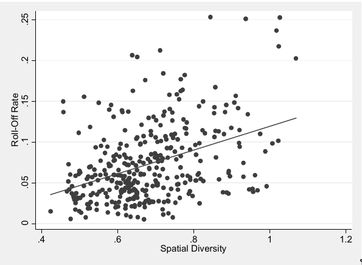

> spatial diversity remained a statistically significant predictor of
roll-off rate. With these variables held constant at their means, a House
district’s shift from the tenth to the ninetieth percentile in spatial
diversity was associated with an increase in roll-off rate of about six
percentage points

 The final political gerrymandering
issue that I investigate is how spatial diversity relates to common dis-
trict plan metrics such as partisan bias and electoral responsiveness.
As noted earlier, partisan bias refers to the divergence in the share of
seats that each party would win given the same share of the statewide
vote.254 For example, if Democrats would win forty-eight percent of
the seats with fifty percent of the vote (in which case Republicans
would win fifty-two percent of the seats), then a district plan would
have a pro-Republican bias of two percent. Electoral responsiveness
refers to the rate at which a party gains or loses seats given changes in
its statewide vote share. For instance, if Democrats would win ten
percent more seats if they received five percent more of the vote, then
a plan would have a responsiveness of 2.0. 255 As a general matter, the
lower a plan’s bias, and the higher its responsiveness, the better the
plan is thought to be. 256

255 See Gelman & King, supra note 11, at 544–45 (defining bias and
responsiveness). 256 Reducing bias all the way to zero is unproblematic.
However, very high rates of responsiveness are undesirable because they
result in large changes in seat shares despite only small shifts in vote
shares. Fortunately, the responsiveness scores reported here are not high
enough to raise such concerns.

Figures 12 and 13 show how states’ spatial diversity averages were
related to partisan bias and electoral responsiveness in the 2006, 2008,
and 2010 elections.260 I include only states with at least ten congres-
sional districts (because bias and responsiveness are not very meaning-
ful for states with small numbers of seats), 261 and I use the absolute
value of bias (because I am interested in the metric’s magnitude rather
than its orientation). As is evident from the first chart, spatial diversi-
ty has a curvilinear relationship with bias. At lower levels of spatial
diversity, that is, bias tends to decrease as spatial diversity increases;
but at higher levels of spatial diversity, bias and spatial diversity tend
to move in tandem. The curve as a whole is clearly U-shaped. 262
This result suggests that states seeking to treat the major parties as
equitably as possible should not minimize the average spatial diversity
of their districts. Consistent with the relevant literature, high levels of
geographic variation are associated with high bias; 263 they both imply

The story with responsiveness is more straightforward. As the se-
cond chart illustrates, responsiveness simply tends to decrease as aver-
age spatial diversity increases. The states whose districts are most
homogeneous, on average, are also the states whose elections are most
responsive to changes in public opinion. In contrast, the states whose
districts are most heterogeneous are also the ones in which even large
swings in voter sentiment have little impact on the parties’ seat shares.
This finding indicates that while high spatial diversity is not a prereq-
uisite for a partisan gerrymander (low spatial diversity can also do the
trick), it is indeed an effective way to protect incumbents of both par-
ties from shifting political tides. Advocates of responsive elections,
then, may push without hesitation for spatially homogeneous districts
to be drawn, since it is these districts that seem most likely (in the ag-
gregate) to reflect the public’s evolving preferences. 265

\cite{steph2012}

## Overview of research strategy

Two key research questions:

1. Do more compact districts have better, equal, or worse spatial diversity
	 scores?
2. Is there an inherent trade-off between compactness and homogeneity?
3. Does spatial diversity give us a normative basis to select one compactness
	 metric over another?

The research procedure:

1. Generate a large and representative subset of plausible districting plans
2. 

### Overview of compactness measures

To empirically evaluate a trade-off between compactness and homogeneity, we
must first define the metrics by which we evaluate a proposed districting plan
over each of these dimensions. Here, I introduce many different compactness
measures. I give a brief overview of the different types of measures, explain
the pros and cons of each, present a compactness measure that I develop, and
support my decision to use an ensemble of measures to increase robustness.

#### Geometric compactness metrics

Shape-based versus dispersion-based

The most 

#### Polsby-Popper

The Polsby-Popper measure, introduced by Polsby and Popper in 1991, is a ratio
of the area of the district to the area of a circle whose circumference is
equal to the perimeter of the district.

$$4\pi \times \frac{A}{P^2}$$

#### Reock

The Reock score is a measure of the ratio of the district to the area of the
minimum bounding circle that encloses the district's geometry.

$$\frac{Area}{AreaOfMinimumBoundingCircle}$$

#### Convex Hull

The Convex Hull metric is a ratio of the area of the district to the area
of the minimum convex polygon that can enclose the district's geometry.

$$\frac{Area}{AreaOfMinimumConvexPolygon}$$

#### Choosing a compactness metric

[^0]: The Polsby-Popper metric measures the ratio of the area of the district
	to the area of a circle whose circumference is equal to the perimeter of the
	district.  But depending on the resolution of the map, the perimeter can be
	effectively infinite. \citeauthor{bswp} find that the choice of resolution
	has "a substantial impact on compactness scores, with the Polsby-Popper score
	especially affected."

Which compactness measure should we choose? All three compactness measures are
well-cited in the literature and enjoy widespread use. They have been cited in
U.S. Supreme Court cases, *amici* briefs, and redistricting commissions
\citep{moncrief2011}. Despite their widespread acceptance, however, the
problems with compactness measures are many, and well-covered in the
literature. No compactness measure is perfect: as an example, the most popular
compactness measure in the literature---Polsby-Popper---is sensitive to small
perturbations in data resolution (the coastline problem). [^0] It is therefore
important to use an *ensemble* of compactness measures to make sure that one's
data and conclusions are robust.

But even this is not enough. Because most compactness measures are purely
geometric, they are all vulnerable to a specific family of geographic
perturbations. Indeed, \cite{bswp} show that minimally tweaking the geometric
features of states is enough for the four most popular compactness measures
(Polsby-Popper, Convex Hull, Reock, Schwartzberg) to give very different
conclusions on nominally identical data.

Thus, it is important to include a non-geometric compactness measure in the
ensemble to guard against the possibility that the results are driven by a
specific quirk in geography. Many such measures have been proposed. For
instance, \cite{dc2016} bring in a discipline of mathematics---graph
theory---to formulate a new metric of compactness.

However, one particular class of metrics I term *point-wise distance metrics*
stands out for its ease of understanding (critical if it is to be persuasive to
Supreme Court judges), theoretical attractiveness, and academic consensus. This
class of compactness metrics tries to measure the distance between two voters
in a district, and assigns higher scores the lower that distance is.

This class of metrics enjoy strong theoretical grounding. Paramount to the idea
of single-member districts is that there is some value in voters who live in
the same area being put into the same district. \cite{er2019}:

> "Voters in the same area are likely to share political interests; voters in the
same area are better able to communicate and coordinate with one another;
politicians can better maintain connections with voters in the same area;
voters in the same area are especially likely to belong to the same social
communities --- all suggest the importance of voters being located in districts
with their geographic peers."

In contrast, districts that carve voters out of their natural communities and
pool them with unrelated, distant voters are bad ones. Therefore, we should be
sensitive not just to geometric shape, but rather whether or not voters live
close to one another. This class of metrics is more readily understandable to
laymen and possesses a normative bent that more abstract mathematical
compactness measures lack. It has therefore been an active area of development
in the literature. \cite{cm2010} present a measure of "bizarreness", which is
the "expected relative difficulty in traveling between two points within the
district". And \cite{fh2011} measures "the distance between voters within the same
district relative to the minimum distance achievable".

\citeauthor{fh2011}'s approach is however an NP-hard problem

I make two key improvements to existing metrics. First, I use driving durations
rather than Euclidean (as-the-crow-flies) distances between voters. This keeps
the metric robust to quirks in political geography like mountains and lakes,
and better represents the notion of natural communities. This idea is not new
and has been discussed in the literature. In fact, while \cite{fh2011} used
Euclidean distance in his metric, he points out its shortcomings:

> Suppose there is a city on a hill. On the West side is [a] mild, long incline
toward the rest of the city, which is in a plane. On the East side is a steep
cliff, either impassable or with just a narrow, winding road that very few
people use. While the next residential center to the East is much closer to
the hilltop on a horizontal plane, it is much further on all sorts
of distances that we think might matter: transportation time, intensity of
social interactions, sets of shared local public goods and common interests,
etc. Thus, for all practical purposes, one probably wants to include the
hilltop in a Western district rather than an Eastern one. More general
notions of distance can handle this.

In this case, driving durations would better reflect this quirk in political
geography. The "impassable" region on the East would have a short Euclidean
distance, and any districting plan that put the hilltop with the Eastern
district would be unfairly penalised by these point-wise distance metrics. On
the other hand, the impassable region would have a long driving duration,
accurately reflecting the political geography. In fact, \citeauthor{fh2011}
specifically suggest using driving durations to improve their metric: "one can
extend much of [our analysis] by using driving distance or what legal scholars
refer to as 'communities of interest'".

The use of driving durations seems strictly superior in many cases involving
human-scale distances. Working with Nicholas Eubank and Jonathan Rodden, I
update their gerrymandering-detection metric to use driving durations instead
\citep{er2019}. We find a consistently different picture of the social context
of American suburban voters, raising the possibility of false positives under
the Euclidean distance measure \citep*{elrwp}.

Why then have 

Similar concerns were echoed by Brian Olson, the creator of BDistricting, who
also chose to use Euclidean distances rather than driving durations because: "It
might be the right kind of thing to measure, but it would take too long... the
large amount of map data and extra computer time to calculate all those travel
times would slow the process down horribly. It would then require a room
filling supercomputer to get an answer in a reasonable amount of time".

Therefore, while many have recognised the theoretical advantages of using
travel times over Euclidean distances / geographic compactness, no one has of
yet come up with a computationally feasible way to use it. By adopting
techniques like downsampling, memoisation, and the use of data structures
from computer science, I can make the calculation of travel times
computationally feasible, and (hopefully) competitive with existing
compactness algorithms like Convex Hull or Polsby-Popper.

Secondly, 

Further details on the metric can be found in Appendix A.

As a result, 

As the Schwartzberg and Polsby-Popper measure are mathematically equivalent, I
include only Polsby-Popper in the ensemble.

I therefore have what I believe to be the most robust ensemble of compactness
measures in the literature

#### Human compactness

### Overview of automated districting algorithms

In order to find out whether compactness measures track spatial diversity, we
have to generate many counterfactual plausible plans that span the entirety of
possible districting plans and measure the correlation between compactness and
spatial diversity. This requires using a computer to draw a large number of
plans according to some minimal criteria.

The idea of drawing a large number of districting plans with a computer has a
long and storied history, starting in the 60s and 70s. The approach has almost
always been used to identify gerrymandering; for instance \cite{ccd2000} build
an algorithm to "quantitatively [assess] whether the [1990 South Carolina] plan
is a racial gerrymander". More recently, \cite{cr2013} "generat[e] a large
number of hypothetical alternative districting plans that are blind as to party
and race, relying only on criteria of geographic contiguity and compactness."
They do this using a Markov Chain simulation algorithm, a procedure that makes
iterative changes for a large number of steps until a unique districting plan
emerges. At each step of \citeauthor{ccd2000}'s algorithm, they randomly select
a Census Block Group to serve as a "seed" of the district, then randomly add
its neighbouring block groups to it until a district with the desired
population is formed. Similarly, \citeauthor{cr2013} begin by initialising all
precincts as an individual, separate district, then randomly agglomerating
neighbouring precincts until the desired number of districts is reached.

While this "standard simulation algorithm" enjoys a certain degree of success,
it has one crippling weakness. The way in which this class of algorithms
operates necessarily explores only a tiny subset of all possible districting
plans. Subsequent work pointed out this flaw: \citeauthor{mm2018} wrote that
automated processes "may take a biased sample of all possible legislative
maps... and fail to efficiently produce a meaningful distribution of all
alternative maps".  And \citeauthor{fifieldwp} contend that "[standard Monte
Carlo algorithms] are unlikely to yield a representative sample of
redistricting plans for a target population." [^1] This poses a huge issue for the
validity of any statistical analysis, because any correlation that we discover
on a biased subset of plans may be spurious when measured over the actual
distribution of plans. [^2] 

[^1]: See \cite{fifieldwp}, pg. 16, for a technical explanation of why these algorithms
	don't produce uniform redistricting plans: "For example ..., the creation of
	earlier districts may make it impossible to yield contiguous districts. These
	algorithms rely on rejection sampling to incorporate constraints, which is an
	inefficient strategy. More importantly, the algorithms come with no
	theoretical result and are not even designed to uniformly sample
	redistricting plans."

[^2]: Generating a biased sample is not necessarily a problem if all you want
	to do is *optimise*, e.g. draw the most compact plan possible. Recent work
	builds upon this standard algorithm, using Voronoi diagrams or iterative
	flood fill procedures rather than random chance, to assign the precincts to
	be agglomerated. See \cite{lf2019} for a technical overview.

Thankfully, scholars have developed an improvement over the standard algorithm
with stronger theoretical guarantees. This second class of algorithms reframe
the districting problem as a *graph partition* problem (borrowing insights from
graph theory and computer science), and use a *Markov Chain Monte Carlo* (MCMC)
approach to sample possible districting plans. This approach is best laid out
in \cite{fifieldwp}. Broadly speaking, the approach initialises a specific
graph partition as a step in the Markov Chain, then *flips* a random node of
the graph to get another valid partition. This process is repeated until the
Markov Chain approaches its steady state distribution: when this happens, the
Markov chain is called "well-mixed".

This class of algorithms inherit desirable well-known theoretical guarantees of
the Markov Chain.[^3] They are therefore much less likely (both theoretically and
empirically) to generate a biased subset of plans. Conducting a small-scale
validation study on a 25-precinct set, \citeauthor{fifieldwp} compare the
distribution of plans generated by their algorithm to those generated by the
standard redistricting algorithm. They prove that their algorithm produces
plans that hew much more closely to the *actual* distribution of all possible
districting plans.

[^3]: See \cite{ddj2019recom} for a technical overview

Due to the many advantages of the MCMC approach, I use it in all my analyses. I
use an superior proposal distribution called Recombination (Recom) by
\citeauthor{ddj2019recom}, which uses a spanning tree method to bipartition
pairs of adjacent districts at each step \citep{ddj2019comp}. This proposal
distribution improves upon the `Flip` proposal in \citeauthor{fifieldwp} in two
significant ways: it generates plans in much fewer steps [^4], and it generates
plans that are much more realistic. The `Flip` proposal tends to generate very
uncompact, snakelike districts, as can be seen in the figure.

[^4]: the "mixing time" of the Markov Chain---that is, the number of steps it
	takes for the Markov Chain to be "close enough" to the stationary
	distribution---is order of magnitudes smaller in `Recom` compared to `Flip`.

## Data generation

1. Generate 100,000 districting plans

I download Census Tract level. These can be
downloaded from the [United States Census Bureau](census.gov) website.

I use the open-source software library GerryChain to generate the ensembles.
Replication code and data are included in the Supplementary Information. I
obtain the ReCom Markov chain procedure from one of the co-authors of the
\cite{ddj2019recom} paper, and generate 10,000 districting plans for 10 states
(Connecticut, Georgia, Idaho, Louisiana, Maine, Maryland, New Hampshire, Rhode
Island, Utah, and Wisconsin) for a total of 100,000 plans.

2. Calculate spatial diversity and compactness scores for each of the 100,000
	 districting plans

I obtain data on spatial diversity from Professor Nicholas Stephanopoulos

In order to keep the calculation of human compactness to a reasonable time, I
first precalculate a *duration matrix* for every state: this gives the
point-to-point driving durations from each voter to every other voter in the
state. In order to 

I obtain voter data from \citeauthor{er2019}, 

In order to do this, I have to 

3. Analyse 

## Results

- Small urban districts have high spatial diversity, large rural districts
have low spatial diversity.
- Spatial diversity of an entire plan doesn't really vary no matter how you district
- Individual districts can vary greatly, but it seems to be a case of
"dividing up the pie": improving spatial diversity in one district seems to
counteract the other.
- This may be because all our districts are "fairly-drawn": i.e. not gerrymandered

## Discussion and future work

## Appendix A: Calculation of human compactness

## Very similar paper

We posit that this is due to thepolitical geographies of the two states, and
examining this effect isan important thread for understanding what kinds of
reforms mightor might not be effective in various jurisdictions. Future work
coulduse more sophisticated mathematical and statistical techniques todescribe
a relationship between political geography and the trade-offs we consider here.
Our analysis suggests that a one-size-fits-allapproach to drawing ‘fair’
districts is inappropriate and that indi-vidual states and localities should
carefully consider the relevanttrade-offs when redistricting or implementing
redistricting reforminitiatives. One factor ignored in this analysis, which is
critical to theprocess of drawing districts, isrespecting
communities-of-interest.Even defining and locating geographically such
communities is avery difficult problem, let alone the determination of whether
ornot to preserve that group in a single district. We therefore pro-pose our
analysis as a framework for discussion about trade-offs inredistricting rather
than as a policy recommendation.In this work, we have demonstrated with a
simple model thatdemanding districts be drawn to be as compact as possible
anddemanding that they satisfy a notion of partisan symmetry areincompatible,
but to different degrees depending on the particularfeatures of the geographic
region in question. Since existing propos-als and methodologies for automated
and algorithmic redistrictinginvolve finding an approximate solution to an
optimization problem,it is important to understand how changing the objective
functionof these procedures can affect the outcome. As more
jurisdictionsconsider redistricting reforms, they should be cautious about
abdi-cating the line drawing process to algorithms which encode valuesdifferent
from those of the voters who use the districts to elect theirrepresentatives.

