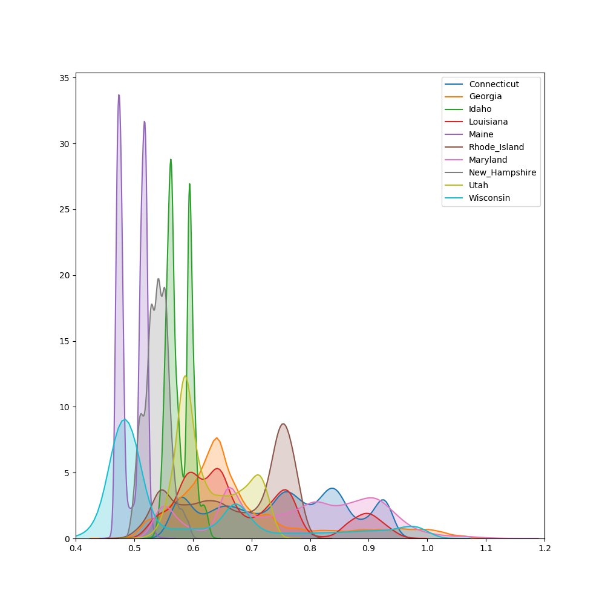

### How district homogeneity varies within districts and states (really needs work!)

In this section, I show that spatial diversity varies enormously between
districts, but this is to a large extent dependent on the state's political
geography. I find that small urban districts have high spatial diversity, while
large rural ones have low spatial diversity---regardless of districting plan.
This also extends to the level of the state: while the spatial diversity of
districting plans can range from 0.4 to 0.9, the spatial diversity of a state's
districting plan usually lies within a small range of ~0.05.

Figure \ref{sd_all_districts} is a kernel density estimation (KDE) plot of the
distribution of spatial diversity in all districts. As in
\citeauthor{steph2012}'s results, the distribution appears log-normal, with a
noticeable tail on the right that contains a number of especially heterogeneous
districts.


A tempting conclusion to draw from the data is that these districts are
equally distributed over the different states. In reality, though, the
districts of a state can only take on a small range of values no matter how a
districting plan is drawn. Figure \ref{sd_districts_binned} demonstrates. The
peaks imply a multimodal distribution where individual districts are
clustered around certain values and not others. This is most starkly
displayed in the states with only two districts. Despite the fact that the
redistricting algorithm is continuous, there is a sharp bimodal distribution
present in the states of Idaho and Maine, and to a lesser degree Utah and New
Hampshire.

This finding is somewhat surprising. It implies that even though the MCMC
algorithm explores the entire set of feasible districting plans, any district
in any feasible plan will take on a specific form. In other words---no matter
how one draws the plan, each district's spatial diversity is largely pinned
down by its state's political geography. Some states have very spatially
diverse districts, some states have very homogeneous ones, and this is a
function of their geography and not the way the districts are drawn.



Given that each district's spatial diversity is largely exogenous, we should
expect each state's overall spatial diversity not to vary much as well.
Indeed, we see in Figure \ref{sd_plans} that each state occupies a narrow
band in the range of possible spatial diversity scores. While the range of
spatial diversity scores ranges from 0.50 to 0.80, the range of a state's
spatial diversity score is only 0.05. While this range is small, it is not
insignificant. Figure \ref{sd_responsiveness} shows that an increase in a
state's spatial diversity by 0.05 is correlated with a decrease in electoral
responsiveness by 0.3, about 10% of the variance.
 
\begin{table}[h!] 
\begin{center}
\caption{OLS Regression of Spatial Diversity on Human Compactness with
Country Dummies}
\label{table:ols_sd_hc}
\begin{tabular}{lclc}
\toprule
\textbf{Dep. Variable:}    &        sd        & \textbf{  R-squared:         } &     0.988   \\
\textbf{Model:}            &       OLS        & \textbf{  Adj. R-squared:    } &     0.988   \\
\textbf{Method:}           &  Least Squares   & \textbf{  F-statistic:       } & 8.188e+05   \\
\textbf{Date:}             & Wed, 11 Mar 2020 & \textbf{  Prob (F-statistic):} &     0.00    \\
\textbf{Time:}             &     20:23:45     & \textbf{  Log-Likelihood:    } & 3.2365e+05  \\
\textbf{No. Observations:} &      100000      & \textbf{  AIC:               } & -6.473e+05  \\
\textbf{Df Residuals:}     &       99989      & \textbf{  BIC:               } & -6.472e+05  \\
\textbf{Df Model:}         &          10      & \textbf{                     } &             \\
\bottomrule
\end{tabular}
\begin{tabular}{lcccccc}
                      & \textbf{coef} & \textbf{std err} & \textbf{t} & \textbf{P$> |$t$|$} & \textbf{[0.025} & \textbf{0.975]}  \\
\midrule
\textbf{C(state)[09]} &       0.7837  &        0.001     &  1042.069  &         0.000        &        0.782    &        0.785     \\
\textbf{C(state)[13]} &       0.7111  &        0.001     &   993.725  &         0.000        &        0.710    &        0.713     \\
\textbf{C(state)[16]} &       0.6054  &        0.001     &   856.490  &         0.000        &        0.604    &        0.607     \\
\textbf{C(state)[22]} &       0.7149  &        0.001     &  1039.373  &         0.000        &        0.714    &        0.716     \\
\textbf{C(state)[23]} &       0.5303  &        0.001     &   626.929  &         0.000        &        0.529    &        0.532     \\
\textbf{C(state)[24]} &       0.8030  &        0.001     &  1097.735  &         0.000        &        0.802    &        0.804     \\
\textbf{C(state)[33]} &       0.5705  &        0.001     &   725.232  &         0.000        &        0.569    &        0.572     \\
\textbf{C(state)[44]} &       0.7073  &        0.001     &   899.177  &         0.000        &        0.706    &        0.709     \\
\textbf{C(state)[49]} &       0.6561  &        0.001     &   959.927  &         0.000        &        0.655    &        0.657     \\
\textbf{C(state)[55]} &       0.6138  &        0.001     &   858.803  &         0.000        &        0.612    &        0.615     \\
\textbf{hc}           &      -0.0404  &        0.001     &   -40.632  &         0.000        &       -0.042    &       -0.038     \\
\bottomrule
\end{tabular}
\begin{tabular}{lclc}
\textbf{Omnibus:}       & 3979.140 & \textbf{  Durbin-Watson:     } &    1.171  \\
\textbf{Prob(Omnibus):} &   0.000  & \textbf{  Jarque-Bera (JB):  } & 9332.569  \\
\textbf{Skew:}          &  -0.236  & \textbf{  Prob(JB):          } &     0.00  \\
\textbf{Kurtosis:}      &   4.420  & \textbf{  Cond. No.          } &     67.9  \\
\bottomrule
\end{tabular}
\end{center}
\end{table}


```
10th percentile:
                   coef    std err          t      P>|t|
hc              -0.0256      0.001    -19.660      0.000
pp               0.0339      0.001     34.757      0.000
reock            0.0287      0.001     34.723      0.000
ch              -0.0001      0.001     -0.143      0.886

25th percentile:
                   coef    std err          t      P>|t|
hc              -0.0274      0.002    -16.018      0.000
pp               0.0357      0.001     30.861      0.000
reock            0.0307      0.001     33.635      0.000
ch              -0.0024      0.001     -2.153      0.031

50th percentile:
                   coef    std err          t      P>|t|
hc              -0.0514      0.003    -15.722      0.000
pp               0.0154      0.001     10.269      0.000
reock            0.0267      0.001     24.400      0.000
ch              -0.0119      0.001     -8.627      0.000

75th percentile:
                   coef    std err          t      P>|t|
hc              -0.1154      0.007    -17.023      0.000
pp              -0.0338      0.002    -14.814      0.000
reock            0.0185      0.002     12.136      0.000
ch              -0.0589      0.002    -30.961      0.000

90th percentile:
                   coef    std err          t      P>|t|
hc              -0.0396      0.013     -3.098      0.002
pp               0.0412      0.005      7.756      0.000
reock            0.0074      0.003      2.285      0.022
ch              -0.0274      0.004     -6.862      0.000
```
